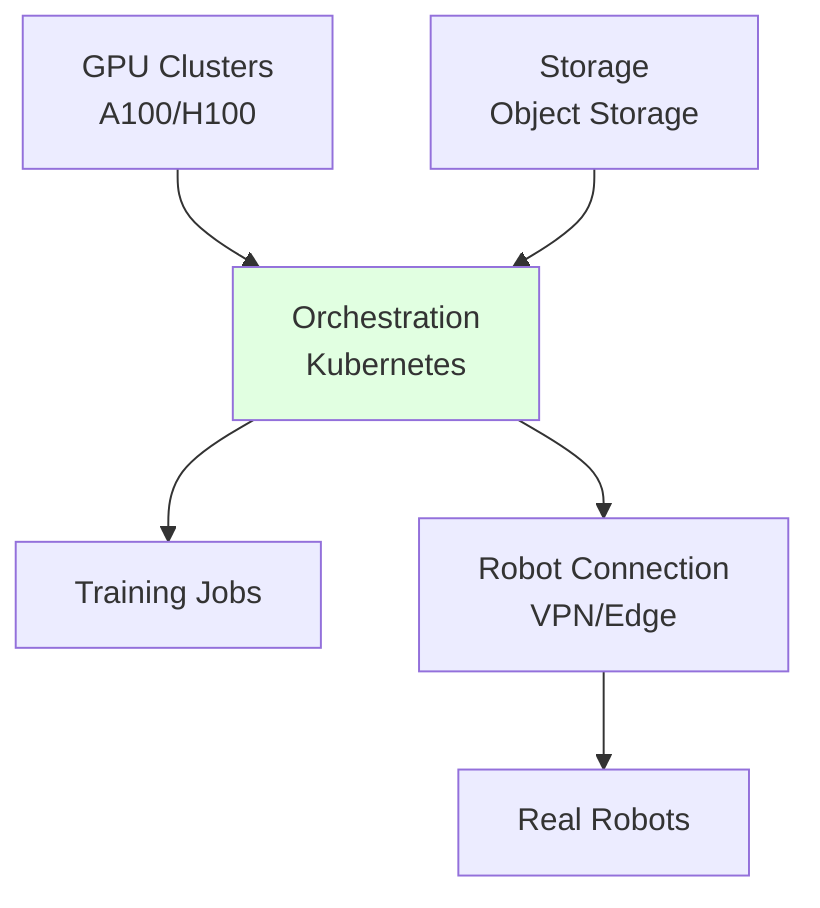

# Cloud Labs for Robotics

## Learning Objectives

- Understand cloud architectures for robotics
- Compare on-prem vs cloud for different use cases
- Configure cloud resources for robot development

## Prerequisites

- Read: [On-Prem Labs](./on-prem-labs)

## Cloud Components

## CapEx vs OpEx

| Factor | On-Prem | Cloud |
|--------|----------|-------|
| **Cost** | High upfront | Pay-as-you-go |
| **Scalability** | Limited | Elastic |
| **Control** | Full | Managed |
| **Latency** | Low | Network dependent |

## System Connectivity

Next: [Hardware Summary](./hardware-summary)

## References

- AWS (2024). *AWS RoboMaker*. https://aws.amazon.com/robomaker
