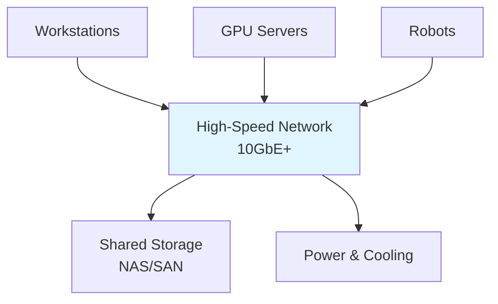

# On-Premises Labs

## Learning Objectives

- Design on-premise robotics labs
- Understand CapEx requirements for hardware
- Configure network and storage for robotics work

## Prerequisites

- Read: [Sensors](./sensors-robotics)

## Lab Components

## System Connectivity

Next: [Cloud Labs](./cloud-labs)

## References

- NVIDIA (2024). *DGX System Documentation*. https://www.nvidia.com
