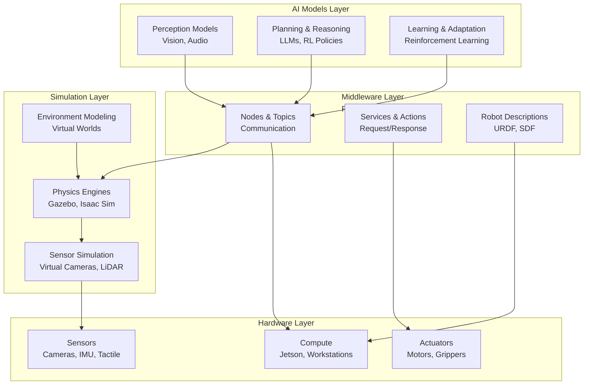
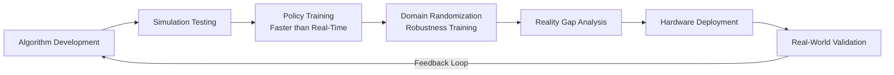

import Mermaid from '@theme/Mermaid';

# Introduction to Physical AI

## Learning Objectives

By the end of this introduction, you will be able to:
- Explain what Physical AI is and why it differs from traditional digital AI
- Understand the concept of embodied intelligence
- Describe the role of simulation in robotics development
- Identify key components of Physical AI systems

## Prerequisites

- Basic understanding of AI and machine learning concepts
- Familiarity with Python programming
- Fundamental knowledge of computing systems

## What is Physical AI?

Physical AI, also known as Embodied AI, refers to artificial intelligence systems that interact with the physical world through sensors and actuators. Unlike traditional AI that operates purely in digital spaces (processing data, making predictions, generating text), Physical AI systems have a "body" that enables them to:

- **Perceive** the world through sensors (cameras, LiDAR, microphones, tactile sensors)
- **Act** on the world through actuators (motors, grippers, wheels, robotic arms)
- **Learn** from physical interactions (collision dynamics, friction, material properties)
- **Navigate** complex, uncertain environments

Physical AI bridges the gap between **digital intelligence** (algorithms, models, reasoning) and **physical embodiment** (hardware, physics, real-world constraints). It's the intersection of AI, robotics, control theory, and physics.

### The Physical AI Stack



## Why Physical AI Matters

Physical AI represents a fundamental shift in how we think about artificial intelligence. Consider these key differences:

| Aspect | Digital AI | Physical AI |
|---------|-----------|-------------|
| **Environment** | Controlled, deterministic | Unpredictable, noisy |
| **Constraints** | Memory, compute | Physics, energy, wear |
| **Feedback** | Accuracy metrics | Real-world consequences |
| **Data** | Static datasets | Continuous sensory streams |
| **Failure Modes** | Incorrect predictions | Damage, unsafe situations |

Physical AI systems must reason about **real physics**: gravity, friction, momentum, material properties, collision dynamics. These constraints don't exist in purely digital AI applications like image classification or text generation.

### Real-World Applications

Physical AI powers:
- **Autonomous vehicles** navigating traffic and pedestrians
- **Humanoid robots** working alongside humans in factories and homes
- **Drone delivery systems** handling weather and obstacles
- **Medical robots** performing precise surgeries
- **Exploration robots** operating in space, deep ocean, or hazardous environments

Each application requires AI to understand and interact with physical reality, not just process information.

## Embodied Intelligence

Embodied intelligence is the idea that intelligence emerges from the interaction between an agent's **brain** (AI models, planning algorithms) and its **body** (sensors, actuators, morphology). This concept challenges traditional views that treat intelligence as purely cognitive or computational.

### Key Principles

1. **Perception-Action Loops**: Physical AI systems continuously cycle between sensing, processing, and acting. This closed-loop structure enables real-time adaptation to changing conditions.

2. **Morphological Computation**: The physical design of a robot (shape, sensor placement, actuator configuration) influences how intelligence emerges. A robot with wheels solves navigation differently than one with legs.

3. **Affordance Learning**: Robots learn what they can *do* with objects, not just *what* objects are. A cup isn't just a "cup"—it's something that can be grasped, lifted, filled, and poured.

4. **Grounding in Reality**: Physical AI systems develop "common sense" about the world through interaction, not just from text or images. They learn that objects fall when dropped, that friction prevents sliding, and that pushing too hard breaks things.

## Simulation-First Workflows

Physical AI development relies heavily on **simulation** for several critical reasons:

### Why Simulation Matters

1. **Accessibility**: Not everyone has access to physical robots. Simulation makes robotics learning accessible to students, researchers, and developers without expensive hardware.

2. **Safety**: Learning and testing in simulation avoids damaging real hardware or creating unsafe situations. A robot learning to walk in simulation can fall millions of times without consequences.

3. **Speed**: GPU-accelerated simulation can run **faster than real-time**, enabling rapid iteration and training. What takes a day on a physical robot might take an hour in simulation.

4. **Determinism**: Simulation provides controlled, repeatable environments for debugging and algorithm development.

5. **Scale**: Simulation enables training across thousands of parallel environments simultaneously, impossible with physical hardware.

### The Sim-to-Real Pipeline



**Domain randomization**—varying simulation parameters like lighting, textures, physics properties during training—helps bridge the gap between simulation and reality by preparing algorithms for real-world variability.

## Code Example: Digital vs Embodied AI

To illustrate the difference, consider a simple perception task:

### Digital AI Approach (Image Classification)

```python
# Digital AI: Classify an image
import torch
from torchvision import models, transforms

# Load a pre-trained model
model = models.resnet18(pretrained=True)
model.eval()

# Preprocess image
transform = transforms.Compose([
    transforms.Resize(256),
    transforms.CenterCrop(224),
    transforms.ToTensor(),
])

# Classify
image = load_image('cup.jpg')
input_tensor = transform(image).unsqueeze(0)
output = model(input_tensor)
predicted_class = output.argmax().item()

print(f"This is a: {predicted_class}")
# Output: This is a: 28 (cup)
```

This AI "knows" what a cup is but has no concept of *what to do* with it.

### Physical AI Approach (Object Interaction)

```python
# Physical AI: Detect and interact with a cup
import rclpy
from rclpy.node import Node
from sensor_msgs.msg import Image
from geometry_msgs.msg import Twist

class CupInteractionNode(Node):
    def __init__(self):
        super().__init__('cup_interaction')
        # Perception: Subscribe to camera
        self.camera_sub = self.create_subscription(
            Image, '/camera/rgb', self.detect_cup, 10)
        # Actuation: Control mobile base
        self.cmd_pub = self.create_publisher(
            Twist, '/cmd_vel', 10)

    def detect_cup(self, msg):
        """
        Detect cup and plan approach trajectory.
        Physical AI considers: distance, obstacles,
        base dynamics, collision constraints.
        """
        cup_detected, cup_location = self.run_detection(msg)
        if cup_detected:
            # Plan approach considering physical constraints
            approach_cmd = self.plan_approach(cup_location)
            self.cmd_pub.publish(approach_cmd)

    def plan_approach(self, location):
        """
        Compute actuation command to reach cup.
        Embodied intelligence handles:
        - Motor dynamics
        - Friction
        - Collision avoidance
        - Safety constraints
        """
        cmd = Twist()
        # Simplified: move toward cup
        cmd.linear.x = 0.2  # m/s
        # Rotate to face cup
        cmd.angular.z = location.yaw
        return cmd
```

This Physical AI system not only recognizes the cup but also plans and executes a physical interaction, accounting for real-world dynamics and constraints.

## System Connectivity: What Comes Next?

This introduction establishes the foundational concepts for the entire book:

- **Module 1** explores Physical AI foundations in depth—embodied intelligence principles, digital vs physical AI, and simulation workflows
- **Module 2** introduces ROS 2, the middleware that connects perception, planning, and actuation in Physical AI systems
- **Module 3** covers digital twin simulation platforms (Gazebo, Unity) that enable simulation-first development
- **Modules 4-6** build on these foundations to explore advanced topics: NVIDIA Isaac for GPU-accelerated robotics, VLA systems for conversational robots, and humanoid-specific challenges

Continue to [Why Humanoid Robotics Matters](./why-humanoid-robotics-matters) to understand why humanoids represent the cutting edge of Physical AI research.

## Transferability Notes

**Physical AI principles apply beyond humanoids**:
- **Quadrupeds** (like Boston Dynamics' Spot) use similar perception-action loops and simulation training approaches
- **Mobile manipulators** (robot arms on wheeled bases) share navigation and manipulation concepts
- **Drones** require real-time perception and control dynamics similar to humanoid locomotion
- **Industrial robots** benefit from digital twin simulation for safety and optimization

While this book uses humanoids as primary examples, the concepts—embodied intelligence, sensor fusion, physics-aware planning, sim-to-real transfer—are universal across Physical AI systems.

## Summary

**Key Takeaways:**

1. **Physical AI** bridges digital intelligence and physical embodiment through sensors and actuators
2. **Embodied intelligence** emerges from the interaction between AI models and physical bodies
3. **Simulation-first workflows** make robotics accessible, safe, and fast for development
4. **The Physical AI stack** integrates AI models, middleware (ROS 2), simulation, and hardware
5. **Transferability**: While humanoids are our focus, Physical AI principles apply to all embodied systems

**Next Steps:**

Continue to [Why Humanoid Robotics Matters](./why-humanoid-robotics-matters) to understand why humanoids represent the cutting edge of Physical AI research.

## References

- OpenAI (2023). *ChatGPT and the future of embodied AI*. https://openai.com
- Robotis (2024). *What is embodied intelligence?*. https://emanual.robotis.com
- NVIDIA (2024). *Isaac Sim for robotics research*. https://developer.nvidia.com/isaac-sim
- Kuffner, J. et al. (2002). *Autonomous navigation for humanoid robots*. Robotics and Autonomous Systems.
