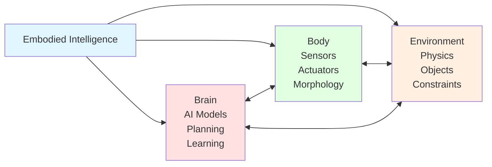
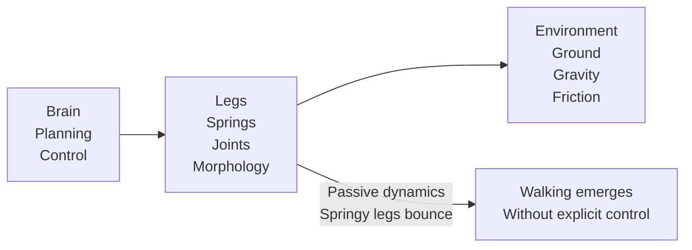

# Embodied Intelligence

## Learning Objectives

By end of this chapter, you will be able to:
- Define embodied intelligence and explain why physical embodiment matters
- Describe affordance learning and its role in Physical AI
- Explain morphological computation and how robot design influences intelligence
- Understand grounding: how Physical AI develops common sense through interaction

## Prerequisites

- Read: [What is Physical AI?](./what-is-physical-ai)
- Basic understanding of AI and machine learning concepts

## What is Embodied Intelligence?

**Embodied intelligence** is the view that intelligence emerges not just from algorithms, but from the interaction between an agent's brain (AI models, planning algorithms) and its body (sensors, actuators, physical morphology).

This perspective challenges traditional AI, which treats intelligence as purely computational: feed data into a neural network, get predictions. Embodied intelligence argues that **having a body fundamentally changes what intelligence looks like**.

### The Embodiment Thesis



Intelligence emerges from the **continuous interaction** of brain, body, and environment. Change any component, and intelligence manifests differently.

### Why Embodiment Matters

Consider a simple task: **pick up a cup**.

**Digital AI (disembodied)**:
- Learns from images labeled "cup", "grasping", "not grasping"
- Predicts: "cup is present", "grasping should succeed"
- Has no concept of: weight, balance, collision, force limits

**Physical AI (embodied)**:
- Learns by trying to pick up actual cups
- Develops understanding through trial and error
- Learns about: cup weight, grip strength, required force, surface friction
- Can adapt to: different cup materials, contents, table surfaces

The embodied agent develops **grounded understanding**—knowledge rooted in physical interaction rather than abstract labels.

## Affordance Learning

**Affordances** are what objects *afford* or *allow* an agent to do. A chair affords sitting; a handle affords grasping; a door affords opening.

### Affordances vs Object Recognition

| Object Recognition | Affordance Learning |
|-------------------|---------------------|
| "This is a cup" | "I can lift, pour, and drink from this" |
| "This is a chair" | "I can sit, stand on, or move this" |
| "This is a door" | "I can open, close, or go through this" |

Object recognition tells you *what* something is. Affordance learning tells you *what you can do* with it.

### Gibson's Ecological Psychology

James Gibson (1979) introduced affordances in ecological psychology:
- Affordances are **objective properties** of environment relative to agent
- They are **action possibilities** environment offers to agent
- They depend on both environment **and** agent capabilities

Example: A door knob affords turning for an adult human, but not for an infant or a robot with different hand morphology.

### Affordance Learning in Physical AI

Physical AI systems learn affordances through interaction:

```python
# Conceptual: affordance learning through exploration
class AffordanceLearner:
    """
    Learns affordances by interacting with objects.
    """
    def __init__(self):
        # Affordance database: object -> possible actions, success rates
        self.affordances = {}

    def interact(self, object_type, action):
        """
        Try an action on object and observe outcome.
        """
        # Execute action
        outcome = self.execute_action(object_type, action)

        # Update affordance knowledge
        if object_type not in self.affordances:
            self.affordances[object_type] = {}

        if action not in self.affordances[object_type]:
            self.affordances[object_type][action] = []

        self.affordances[object_type][action].append(outcome)

    def get_affordances(self, object_type):
        """
        Return actions object affords (based on learned success rates).
        """
        if object_type not in self.affordances:
            return []

        # Return actions with >50% success rate
        actions = []
        for action, outcomes in self.affordances[object_type].items():
            success_rate = sum(outcomes) / len(outcomes)
            if success_rate > 0.5:
                actions.append(action)

        return actions

# Example: robot learns affordances for cup
robot = AffordanceLearner()

# Try different actions
robot.interact("cup", "lift")      # Outcome: True (success)
robot.interact("cup", "pour")      # Outcome: True
robot.interact("cup", "drink_from") # Outcome: True
robot.interact("cup", "sit_on")    # Outcome: False (cup breaks)

print(robot.get_affordances("cup"))
# Output: ["lift", "pour", "drink_from"]
```

Through exploration, robot learns **what actions a cup affords** for its specific morphology and capabilities.

## Morphological Computation

**Morphological computation** is the idea that an agent's body (morphology) itself performs computation, not just the brain.

### Example: Robot Legs

Consider a robot learning to walk:



**Passive walkers** (McGeer, 1990) demonstrated that robots with properly designed legs can walk down slopes without any active control—gravity and leg morphology do the "computation."

### Morphology Affects Intelligence

Same "brain" (algorithm) with different "bodies" produces different behaviors:

| Robot Morphology | Walking Strategy | Energy Efficiency |
|------------------|------------------|-------------------|
| **Static biped** (stiff joints) | Careful, slow | Low efficiency |
| **Dynamic biped** (compliant) | Natural, springy | High efficiency |
| **Quadruped** | Trotting, bounding | Medium efficiency |
| **Wheeled** | Rolling | Highest efficiency |

The **same walking controller** produces different gait patterns, energy profiles, and capabilities depending on leg design, joint stiffness, and mass distribution.

### Implications for Physical AI

Morphological computation means:
1. **Design matters**: Good body design reduces required computation
2. **Co-optimization**: Brain and body should be designed together
3. **Transfer challenges**: Algorithms optimized for one morphology don't transfer directly to another

## Grounding: Common Sense Through Interaction

**Grounding** is the process by which abstract knowledge becomes tied to physical reality. Physical AI develops "common sense" through interaction with world.

### The Symbol Grounding Problem

Traditional AI uses **symbols** (words, labels) that aren't grounded:
- "cup" = word, token, embedding vector
- "red" = color label, RGB value
- "heavy" = weight category, number

But these symbols have no **intrinsic meaning**—they're just patterns.

Physical AI grounds symbols through interaction:
- "cup" = object that feels like this, weighs this much, holds liquid
- "red" = color of this apple, this fire truck, this light
- "heavy" = object that strains my gripper, requires more force to lift

### Grounding in Practice

Consider a robot learning about "slippery":

```python
# Conceptual: grounding through interaction
class GroundingAgent:
    """
    Grounds abstract concepts in physical interaction.
    """
    def __init__(self):
        self.concepts = {}  # concept -> sensory-motor experiences

    def interact_and_label(self, experience, labels):
        """
        Associate labels with sensory-motor experiences.
        """
        for label in labels:
            if label not in self.concepts:
                self.concepts[label] = []

            self.concepts[label].append(experience)

    def check_concept(self, label, experience):
        """
        Check if experience matches grounded concept.
        """
        if label not in self.concepts:
            return False

        # Compare current experience to learned ones
        for learned in self.concepts[label]:
            if self.similar(experience, learned):
                return True

        return False

    def similar(self, exp1, exp2):
        """
        Compare two sensory-motor experiences.
        """
        # Simplified: compare key features
        return abs(exp1['friction'] - exp2['friction']) < 0.2

# Robot learns about "slippery"
robot = GroundingAgent()

# Interact with ice
ice_experience = {
    'visual': 'white, shiny',
    'tactile': 'smooth, cold',
    'friction': 0.1,  # Very low
    'movement': 'slid unexpectedly'
}
robot.interact_and_label(ice_experience, ['slippery', 'ice'])

# Interact with wood
wood_experience = {
    'visual': 'brown, matte',
    'tactile': 'rough',
    'friction': 0.7,  # Moderate
    'movement': 'stable'
}

# Check if wood is slippery
print(robot.check_concept('slippery', wood_experience))
# Output: False (wood is not slippery)

# Interact with polished metal
metal_experience = {
    'visual': 'gray, shiny',
    'tactile': 'smooth',
    'friction': 0.2,
    'movement': 'slid slightly'
}
print(robot.check_concept('slippery', metal_experience))
# Output: True (metal is slippery)
```

Through interaction, robot grounds "slippery" in **low friction, smooth surfaces**—not just as a word or label, but as a set of physical experiences.

## Code Example: Embodied Exploration

```python
"""
Embodied exploration: robot learns about world through interaction.
This is conceptual; real systems use more sophisticated RL.
"""

import random

class EmbodiedExplorer:
    """
    Learns about objects through embodied interaction.
    """
    def __init__(self):
        # Knowledge: what each action does to each object type
        self.knowledge = {}

    def explore(self, objects):
        """
        Explore objects through interaction.
        """
        for obj in objects:
            if obj['type'] not in self.knowledge:
                self.knowledge[obj['type']] = {}

            # Try different actions
            for action in ['push', 'lift', 'grasp']:
                outcome = self.try_action(obj, action)

                if obj['type'] not in self.knowledge:
                    self.knowledge[obj['type']] = {}

                self.knowledge[obj['type']][action] = outcome

    def try_action(self, obj, action):
        """
        Try an action on object and observe outcome.
        """
        # Simulated physics (in real system: use actual robot)
        if action == 'push':
            # Check if object is movable
            if obj['weight'] < 10.0:  # kg
                return {'success': True, 'displacement': obj['weight'] * 0.1}
            else:
                return {'success': False, 'reason': 'too_heavy'}

        elif action == 'lift':
            if obj['weight'] < 5.0 and obj['has_handle']:
                return {'success': True, 'lifted': True}
            else:
                return {'success': False, 'reason': 'unliftable'}

        elif action == 'grasp':
            if obj['graspable']:
                return {'success': True, 'grip_firm': True}
            else:
                return {'success': False, 'reason': 'not_graspable'}

    def use_knowledge(self, obj_type, action):
        """
        Use learned knowledge to predict action outcome.
        """
        if obj_type in self.knowledge and action in self.knowledge[obj_type]:
            return self.knowledge[obj_type][action]
        else:
            return {'unknown': True}

# Robot explores different objects
robot = EmbodiedExplorer()

objects = [
    {'type': 'cup', 'weight': 0.5, 'has_handle': True, 'graspable': True},
    {'type': 'table', 'weight': 20.0, 'has_handle': False, 'graspable': False},
    {'type': 'box', 'weight': 2.0, 'has_handle': True, 'graspable': True},
]

robot.explore(objects)

# Use knowledge to make decisions
print(robot.use_knowledge('cup', 'lift'))
# Output: {'success': True, 'lifted': True}

print(robot.use_knowledge('table', 'lift'))
# Output: {'success': False, 'reason': 'unliftable'}
```

Through embodied exploration, robot develops **actionable knowledge** about objects—not just labels, but what it can do with them given its morphology and capabilities.

## System Connectivity

Embodied intelligence connects to:
- **Next chapter**: [Digital vs Physical AI](./digital-vs-physical-ai) contrasts embodied systems with traditional AI
- **Module 2 (ROS 2)**: Learn middleware that enables embodied perception-action loops
- **Module 6 (Humanoid Robotics)**: Explore how humanoid morphology shapes intelligence

## Transferability Notes

Embodied intelligence principles apply universally:
- **Any robot** develops knowledge through interaction, regardless of form factor
- **Affordance learning** is relevant for all robots: mobile bases, manipulators, drones
- **Morphological computation** affects all Physical AI systems: design choices impact behavior
- **Grounding** is universal: physical interaction grounds abstract concepts for any embodied agent

## Summary

**Key Takeaways:**

1. **Embodied intelligence** emerges from interaction between brain, body, and environment
2. **Affordance learning**: Robots learn what objects afford (what they can do) through exploration
3. **Morphological computation**: Robot body itself performs computation; design affects intelligence
4. **Grounding**: Physical interaction grounds abstract concepts in reality, developing common sense
5. **Implication**: Same "brain" with different "body" produces different intelligence

**Next Steps:**

Continue to [Digital vs Physical AI](./digital-vs-physical-ai) to contrast embodied systems with traditional digital AI.

## References

- Gibson, J.J. (1979). *The Ecological Approach to Visual Perception*. Houghton Mifflin.
- Pfeifer, R., & Bongard, J. (2006). *How the Body Shapes the Way We Think*. MIT Press.
- McGeer, T. (1990). *Passive dynamic walking*. International Journal of Robotics Research.
