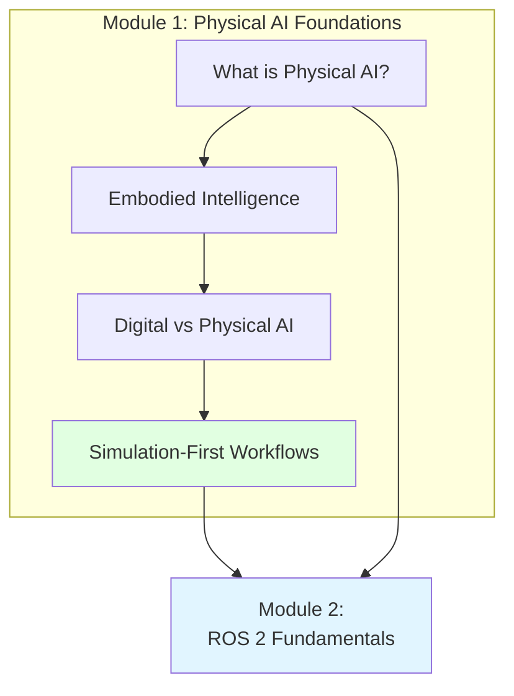

# Module 1: Physical AI Foundations - Summary

## Learning Objectives Achieved

After completing Module 1, you can now:
- Define Physical AI and distinguish it from digital AI
- Explain embodied intelligence and affordance learning
- Understand morphological computation and grounding
- Describe simulation-first development workflows
- Compare simulation platforms for Physical AI

## Key Concepts Covered

### 1. What is Physical AI?
Physical AI integrates AI models with physical embodiment:
- **Perception-action loops**: Continuous sense, plan, act cycles
- **Physical constraints**: Time, physics, energy, safety requirements
- **System components**: Sensors, actuators, compute, perception, planning, control
- **Closed-loop operation**: Generate and learn from own interactions

### 2. Embodied Intelligence
Intelligence emerges from brain-body-environment interaction:
- **Affordance learning**: What objects afford (what can be done)
- **Morphological computation**: Body design influences intelligence
- **Grounding**: Physical interaction grounds abstract concepts in reality
- **Implication**: Same "brain" with different "body" produces different intelligence

### 3. Digital vs Physical AI
Fundamental differences shape system design:
- **Data**: Static datasets vs continuous, noisy streams
- **Time**: No pressure vs real-time constraints (milliseconds)
- **Environment**: Controlled vs unpredictable physical world
- **Feedback**: Accuracy metrics vs physical consequences
- **Deployment**: Easy rollback vs physical updates

### 4. Simulation-First Workflows
Development pipeline bridging digital and physical:
- **Benefits**: Accessibility, speed, safety, scalability, control, cost
- **Sim-to-real pipeline**: Develop → Train → Randomize → Analyze → Identify → Deploy → Validate
- **Domain randomization**: Vary simulation parameters for robustness
- **Platforms**: Gazebo (ROS), Unity (rendering), Isaac Sim (GPU acceleration)

## Knowledge Flow Diagram

## Connections to Future Modules

### Module 1 → Module 2 (ROS 2 Fundamentals)
- **Perception-action loops** are implemented via ROS 2 nodes, topics, services
- **Real-time constraints** shape ROS 2 architecture (DDS, QoS settings)
- **System components** (sensors, actuators, compute) map to ROS 2 hardware interfaces

### Module 1 → Module 3 (Digital Twin Simulation)
- **Simulation-first workflows** are implemented using Gazebo, Unity, Isaac Sim
- **Sim-to-real pipeline** requires understanding simulation platforms and limitations
- **Domain randomization** is configured in simulation environments

### Module 1 → Module 4 (NVIDIA Isaac)
- **GPU-accelerated simulation** (Isaac Sim) enables faster-than-real-time training
- **Perception pipelines** in Isaac build on physical AI principles
- **Embodied intelligence** is implemented using Isaac's RL and simulation tools

### Module 1 → Module 5 (VLA)
- **Embodied intelligence** provides foundation for multimodal (vision-language-action) systems
- **Affordance learning** connects to how LLMs plan robotic actions
- **Grounding** in physical interaction ensures VLA systems are grounded in reality

### Module 1 → Module 6 (Humanoid Robotics)
- **Morphological computation** explains why humanoid design affects intelligence
- **Physical constraints** (balance, energy, stability) drive humanoid control algorithms
- **Embodied intelligence** emerges from humanoids' sensorimotor loops

## Transferability to Other Robot Types

All Module 1 concepts apply universally:

| Concept | Humanoids | Mobile Bases | Manipulators | Drones |
|---------|-----------|---------------|---------------|---------|
| **Perception-action loop** | ✓ | ✓ | ✓ | ✓ |
| **Embodied intelligence** | ✓ | ✓ | ✓ | ✓ |
| **Affordance learning** | ✓ | ✓ | ✓ | ✓ |
| **Simulation-first** | ✓ | ✓ | ✓ | ✓ |
| **Sim-to-real pipeline** | ✓ | ✓ | ✓ | ✓ |

While this book uses humanoids as examples, **Physical AI foundations apply to all robotic systems**.

## Practical Insights

### Choosing AI Models for Physical AI

When selecting AI models for Physical AI systems:
- **Prioritize efficiency**: Model must run within real-time constraints
- **Balance accuracy vs speed**: Larger models may be more accurate but too slow
- **Consider hardware**: GPUs enable larger models; edge devices require lightweight models

### Designing Simulation-First Workflows

When developing Physical AI systems:
- **Start in simulation**: Prototype and train without physical hardware
- **Apply domain randomization**: Vary simulation parameters for robustness
- **Plan sim-to-real transition**: Identify reality gaps early, budget time for system identification
- **Iterate**: Use simulation's speed for rapid iteration; validate in reality regularly

### Understanding Physical Constraints

When designing Physical AI systems:
- **Account for physics**: Gravity, friction, momentum can't be ignored
- **Plan for uncertainty**: Sensors are noisy; environments are unpredictable
- **Design for safety**: Fail-safe modes, force limits, collision detection
- **Optimize for resources**: Battery life, compute capacity, actuator limits matter

## Key Takeaways

1. **Physical AI** bridges digital intelligence and physical embodiment through sensors and actuators
2. **Embodied intelligence** emerges from brain-body-environment interaction
3. **Affordance learning** and **grounding** develop understanding through physical interaction
4. **Physical AI differs** from digital AI in data, time, environment, feedback, and deployment
5. **Simulation-first workflows** enable accessible, fast, safe, and scalable development
6. **Sim-to-real pipeline** requires domain randomization and system identification
7. **Module 1 concepts** apply universally to all Physical AI systems, not just humanoids

## Next Steps

Proceed to **Module 2: ROS 2 Fundamentals** to learn how:
- ROS 2 implements perception-action loops
- Nodes and topics enable real-time communication
- Services and actions provide structured robot control
- URDF describes robot morphology and kinematics
- rclpy enables Python-based Physical AI development

**Module 2** provides the middleware foundation for implementing all Physical AI concepts from Module 1.

## References

- Pfeifer, R., & Bongard, J. (2006). *How the Body Shapes the Way We Think*. MIT Press.
- Gibson, J.J. (1979). *The Ecological Approach to Visual Perception*. Houghton Mifflin.
- Open Robotics (2024). *ROS 2 Documentation*. https://docs.ros.org
- NVIDIA (2024). *Isaac Sim Documentation*. https://docs.omniverse.nvidia.com/isaac-sim
