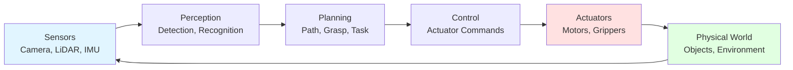
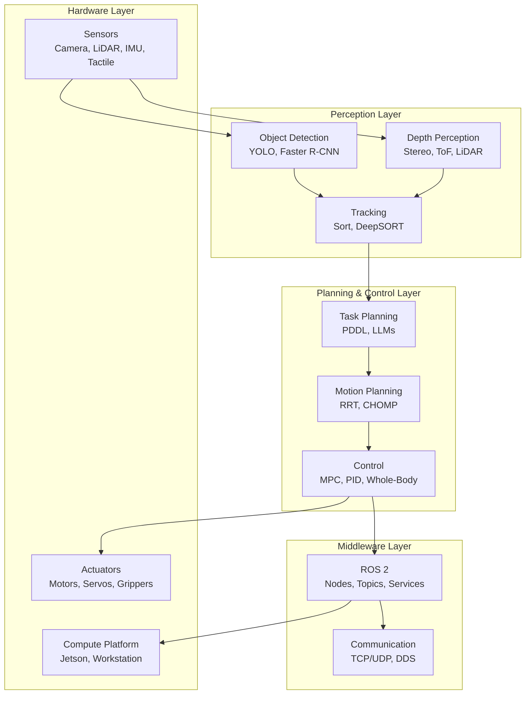

# What is Physical AI?

## Learning Objectives

By end of this chapter, you will be able to:
- Define Physical AI and distinguish it from traditional AI
- Explain the perception-action loop that powers embodied systems
- Describe how physical constraints shape AI behavior
- Identify key components of a Physical AI system

## Prerequisites

- Read: [Introduction to Physical AI](../../intro/physical-ai-fundamentals)
- Basic understanding of AI and machine learning concepts

## Defining Physical AI

**Physical AI** (also called Embodied AI) refers to artificial intelligence systems that:
1. **Interact** with physical world through sensors (cameras, LiDAR, microphones, tactile)
2. **Act** on world through actuators (motors, grippers, wheels, legs)
3. **Learn** from physical interactions (collision, friction, gravity, material properties)
4. **Navigate** uncertain, dynamic environments in real-time

Unlike digital AI that processes data in controlled computational spaces, Physical AI systems exist in and respond to the physical world.

### Digital vs Physical AI Comparison

| Aspect | Digital AI | Physical AI |
|---------|-----------|-------------|
| **Domain** | Purely computational (data, text, images) | Physical world (space, time, physics) |
| **Input** | Static datasets, user queries | Continuous sensor streams |
| **Output** | Predictions, classifications, text | Actions affecting physical state |
| **Constraints** | Memory, compute time | Physics, energy, safety, wear |
| **Feedback** | Accuracy metrics, loss functions | Real-world consequences, collisions |
| **Time** | Often asynchronous | Real-time, continuous |

### The Perception-Action Loop

Physical AI systems operate through continuous **perception-action loops**:



This loop operates continuously, typically at tens to hundreds of times per second:
1. **Perceive**: Sensors gather data about world state
2. **Plan**: AI algorithms decide on actions based on goals and current state
3. **Act**: Actuators execute chosen actions
4. **Observe**: World changes; sensors capture new state
5. **Repeat**: Loop continues, enabling real-time adaptation

### The Closed-Loop Advantage

Closed-loop perception-action is fundamental difference from open-loop digital AI:

**Open-loop (digital AI)**:
```python
# Process a single image once
image = load_image("cat.jpg")
prediction = model.predict(image)
# Done; no further interaction with image or world
```

**Closed-loop (Physical AI)**:
```python
# Continuously interact with world
while not task_complete:
    # Sense
    image = camera.read()
    # Perceive
    objects = perception_model.detect(image)
    # Plan
    target = planner.select_target(objects)
    # Act
    gripper.grasp(target)
    # Observe result
    success = tactile_sensor.read()
    # Adapt next action based on result
    if not success:
        adjust_grasp_strategy()
```

Physical AI systems **learn from their actions**—they don't just process data; they *generate data* by interacting with world.

## Physical Constraints on AI

Physical AI systems operate under constraints digital AI never faces. These constraints fundamentally shape how AI models are designed and deployed.

### 1. Real-Time Requirements

Physical AI must operate within strict timing constraints:
- **Safety**: Stop before collision (tens of milliseconds)
- **Stability**: Adjust balance before fall (hundreds of milliseconds)
- **Performance**: Respond to human interaction (sub-second latency)

This limits model complexity: inference must fit within time budget, often requiring optimized models or specialized hardware (GPUs, TPUs, NPUs).

### 2. Physics and Dynamics

Physical world follows immutable laws:
- **Gravity**: Constant downward acceleration
- **Friction**: Determines grip, sliding, locomotion
- **Momentum**: Moving objects can't stop instantly
- **Collision**: Two objects can't occupy same space

AI models for Physical AI must account for physics:
- **Kinematics**: Robot limb positions and joint angles
- **Dynamics**: Forces, torques, accelerations
- **Collision detection**: Predict and avoid impacts
- **Contact modeling**: Interacting with objects and environment

### 3. Energy and Resource Constraints

Physical robots have limited:
- **Battery life**: Typically 1-4 hours for mobile humanoids
- **Compute capacity**: Edge devices (Jetson) have less power than workstations
- **Actuator limits**: Motors have maximum torque, speed, and duty cycle

This shapes AI system design:
- **Efficient models**: Prefer lightweight architectures (MobileNet, efficient transformers)
- **Selective activation**: Run perception only when needed
- **Offloading**: Move heavy computation to cloud when connectivity allows

### 4. Safety and Uncertainty

Physical world is inherently uncertain:
- **Sensor noise**: Cameras are affected by lighting, dust, weather
- **Actuator error**: Motors don't move exactly as commanded
- **Unpredictable environments**: People move, objects shift, surfaces change

Physical AI systems must handle uncertainty:
- **Robust perception**: Models that handle noisy inputs
- **Redundancy**: Multiple sensors (vision + LiDAR) for reliability
- **Safe failure modes**: When unsure, stop or ask for help
- **Predictive models**: Anticipate possible outcomes and plan conservatively

## Components of a Physical AI System

A Physical AI system integrates multiple hardware and software layers:



### Hardware Components

| Component | Role | Examples |
|-----------|------|----------|
| **Compute** | Run AI models, control algorithms | NVIDIA Jetson AGX, Intel NUC, Workstations |
| **Sensors** | Gather information about world | RGB-D cameras (RealSense), LiDAR (Velodyne), IMU, Tactile |
| **Actuators** | Execute actions on world | DC motors, Servos, BLDC motors, Grippers |

### Software Components

| Component | Role | Examples |
|-----------|------|----------|
| **Perception** | Understand environment from sensor data | Object detection (YOLO), SLAM (ORB-SLAM), Navigation (Nav2) |
| **Planning** | Decide what to do and how | Task planners (PDDL), motion planners (RRT), behavior trees |
| **Control** | Send commands to actuators | PID controllers, MPC, inverse dynamics |

## Code Example: Simple Perception-Action Loop

```python
"""
Simple Physical AI system: detects objects and navigates toward them.
This is a conceptual illustration; real systems use ROS 2
for communication and more sophisticated planning.
"""

import numpy as np
import cv2
import time

class SimplePhysicalAI:
    """
    Minimal perception-action loop for mobile robot.
    """
    def __init__(self):
        # Perception: object detector
        self.object_detector = self.load_detector()

        # Planning: simple state machine
        self.state = "SEARCH"
        self.target_object = None

        # Control: motor commands
        self.linear_speed = 0.0
        self.angular_speed = 0.0

    def load_detector(self):
        """Load pre-trained object detection model."""
        # In practice: use YOLO, Faster R-CNN, etc.
        # Here: simple color detector for illustration
        return cv2.CascadeClassifier(
            cv2.data.haarcascades +
            'haarcascade_frontalface_default.xml'
        )

    def perceive(self, frame):
        """
        Detect objects in camera frame.
        Returns: (detected, location, confidence)
        """
        gray = cv2.cvtColor(frame, cv2.COLOR_BGR2GRAY)
        objects = self.object_detector.detectMultiScale(
            gray, scaleFactor=1.1, minNeighbors=5
        )

        if len(objects) > 0:
            # Pick first detected object
            x, y, w, h = objects[0]
            # Calculate center in image
            center_x = x + w // 2
            center_y = y + h // 2
            return True, (center_x, center_y), 0.8  # Conf: 0.8

        return False, None, 0.0

    def plan(self, detected, location, confidence):
        """
        Decide on action based on perception.
        Simple state machine: SEARCH -> APPROACH -> REACHED
        """
        if not detected:
            self.state = "SEARCH"
            self.angular_speed = 0.5  # Rotate to look
            self.linear_speed = 0.0
        elif detected and confidence > 0.5:
            self.state = "APPROACH"
            image_center = 320  # Assume 640x480 camera
            # Turn toward object
            error = location[0] - image_center
            self.angular_speed = -error * 0.01
            # Move forward if aligned
            if abs(error) < 50:
                self.linear_speed = 0.2
            else:
                self.linear_speed = 0.0

            # Check if reached (based on size)
            if confidence > 0.9:  # Larger = closer
                self.state = "REACHED"
                self.linear_speed = 0.0
                self.angular_speed = 0.0

    def act(self):
        """
        Send commands to motors.
        """
        # In practice: publish to ROS 2 topic /cmd_vel
        # Here: simulate command sending
        print(f"Linear: {self.linear_speed:.2f}, "
              f"Angular: {self.angular_speed:.2f}, "
              f"State: {self.state}")

    def perception_action_loop(self):
        """
        Main closed-loop: continuously perceive, plan, act.
        """
        cap = cv2.VideoCapture(0)  # Open camera

        while True:
            # 1. Perceive
            ret, frame = cap.read()
            if not ret:
                break

            detected, location, confidence = self.perceive(frame)

            # 2. Plan
            self.plan(detected, location, confidence)

            # 3. Act
            self.act()

            # Display for visualization
            cv2.imshow('Physical AI Loop', frame)
            if cv2.waitKey(1) & 0xFF == ord('q'):
                break

        cap.release()
        cv2.destroyAllWindows()

# Run the system
if __name__ == '__main__':
    robot = SimplePhysicalAI()
    robot.perception_action_loop()
```

This example demonstrates the **perception-action loop** that defines Physical AI: sensors, perception, planning, actuation, all operating continuously in closed loop.

## System Connectivity

This chapter established Physical AI fundamentals:

- **Next chapter**: [Embodied Intelligence](./embodied-intelligence) explores how intelligence emerges from sensorimotor loops
- **Module 2 (ROS 2)**: Learn middleware that coordinates perception, planning, and action
- **Module 3 (Simulation)**: Understand how Physical AI systems are developed and tested in virtual worlds

## Transferability Notes

Physical AI principles are universal:
- **Mobile robots** (wheeled, legged) use same perception-action loops
- **Manipulators** (robot arms) plan and execute grasping actions
- **Drones** navigate 3D space using perception for obstacle avoidance
- **Industrial robots** operate under same physical constraints and real-time requirements

While humanoids are used as examples throughout this book, the perception-action loop, physical constraints, and system architecture apply to all Physical AI systems.

## Summary

**Key Takeaways:**

1. **Physical AI** = AI that interacts with physical world through sensors and actuators
2. **Perception-action loop** is the core pattern: sense, plan, act, observe, repeat
3. **Physical constraints** (time, physics, energy, safety) fundamentally shape AI system design
4. **Hardware + Software**: Physical AI integrates sensors, actuators, compute, perception, planning, and control
5. **Closed-loop operation**: Physical AI systems generate and learn from their own interactions with world

**Next Steps:**

Continue to [Embodied Intelligence](./embodied-intelligence) to understand how intelligence emerges from physical interaction.

## References

- Kuffner, J. & LaValle, S. (2000). *RRT-Connect: An efficient approach to single-query path planning*. ICRA.
- Open Robotics (2024). *ROS 2 Documentation*. https://docs.ros.org
- NVIDIA (2024). *NVIDIA Isaac Sim for Robotics*. https://developer.nvidia.com/isaac-sim
