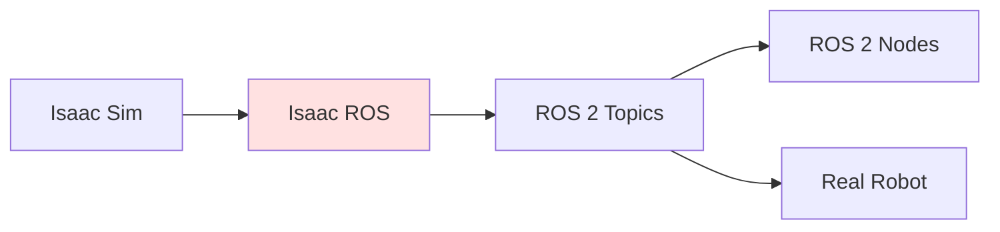

# Isaac ROS Integration

## Learning Objectives

- Integrate Isaac Sim with ROS 2
- Use Isaac ROS packages for GPU robotics
- Bridge simulation and real-world ROS 2 workflows

## Prerequisites

- Read: [VSLAM and Nav2](./vslam-nav2)

## Isaac ROS

## System Connectivity

Next: [Simulation to Real Training](./simulation-to-real-training)

## References

- NVIDIA (2024). *Isaac ROS Documentation*. https://developer.nvidia.com/isaac-ros
