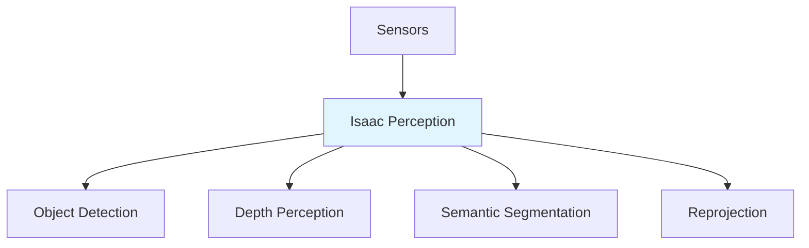

# Perception Pipelines

## Learning Objectives

- Understand Isaac perception components
- Use Isaac Replicator for synthetic data
- Build vision pipelines for robotics

## Prerequisites

- Read: [Isaac Sim GPU](./isaac-sim-gpu)

## Perception Components

## Isaac Replicator

Generate synthetic training data at scale.

## System Connectivity

Next: [VSLAM and Nav2](./vslam-nav2)

## References

- NVIDIA (2024). *Isaac Perception Documentation*. https://docs.omniverse.nvidia.com
