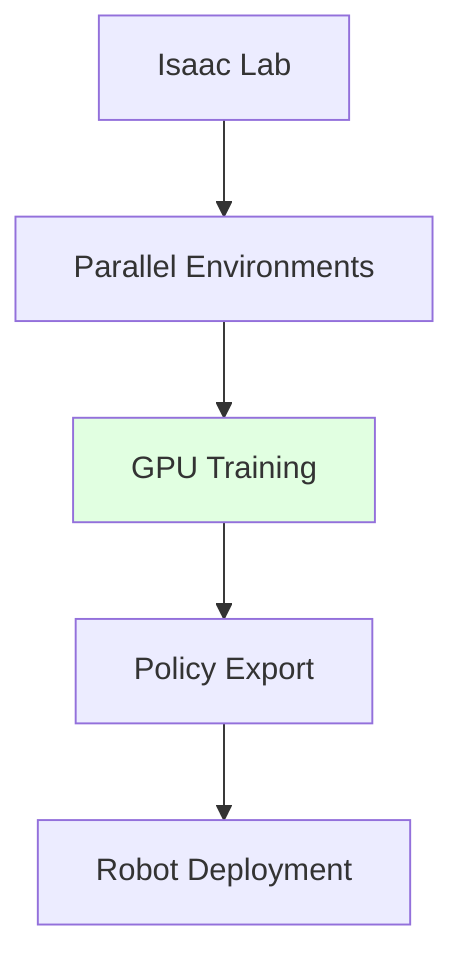

# Simulation to Real Training

## Learning Objectives

- Use Isaac Sim for faster-than-real-time training
- Apply domain randomization in Isaac
- Transfer trained policies to real robots

## Prerequisites

- Read: [Isaac ROS Integration](./isaac-ros-integration)

## Isaac Lab RL

## System Connectivity

Next: [Module 4 Summary](./module-4-summary)

## References

- NVIDIA (2024). *Isaac Lab Documentation*. https://docs.omniverse.nvidia.com/isaac-lab
