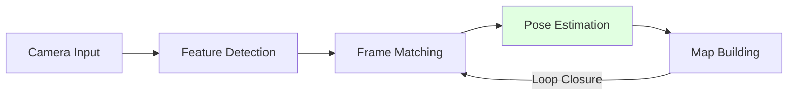

# VSLAM and Nav2

## Learning Objectives

- Understand Visual SLAM for mapping and localization
- Use Nav2 for autonomous navigation
- Integrate VSLAM with navigation stack

## Prerequisites

- Read: [Perception Pipelines](./perception-pipelines)

## VSLAM (Visual SLAM)

## Nav2 Navigation

Navigation 2 stack in ROS 2.

## System Connectivity

Next: [Isaac ROS Integration](./isaac-ros-integration)

## References

- Open Robotics (2024). *Nav2 Documentation*. https://navigation.ros.org
