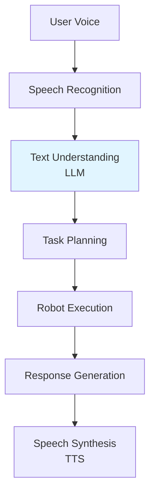

# Conversational Robotics

## Learning Objectives

- Design natural language interfaces for robots
- Handle multi-turn conversations and context
- Combine speech, vision, and action in robotic systems

## Prerequisites

- Read: [Speech Models](./speech-models)

## Conversational Pipeline

## System Connectivity

Next: [Module 5 Summary](./module-5-summary)

## References

- NVIDIA (2024). *Riva Conversational AI*. https://developer.nvidia.com/riva
