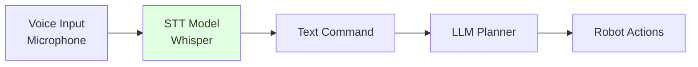

# Speech Models

## Learning Objectives

- Use speech-to-text models for robot control
- Implement voice interfaces with Whisper and similar models
- Handle noise and ambiguity in speech recognition

## Prerequisites

- Read: [LLM Planning](./llm-planning)

## Speech Pipeline

## System Connectivity

Next: [Conversational Robotics](./conversational-robotics)

## References

- OpenAI (2024). *Whisper Documentation*. https://github.com/openai/whisper
