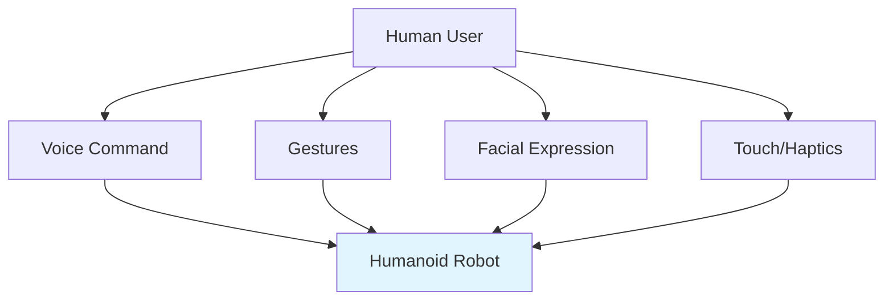

# Human-Robot Interaction

## Learning Objectives

- Design intuitive interfaces for human-humanoid interaction
- Implement social cues and gestures for robots
- Ensure safe collaboration between humans and humanoids

## Prerequisites

- Read: [Locomotion](./locomotion)

## Interaction Modalities

## System Connectivity

Next: [Humanoid Specific Challenges](./humanoid-specific-challenges)

## References

- Breazeal, C. (1999). *How to Make Robots Human-like*. MIT Press.
