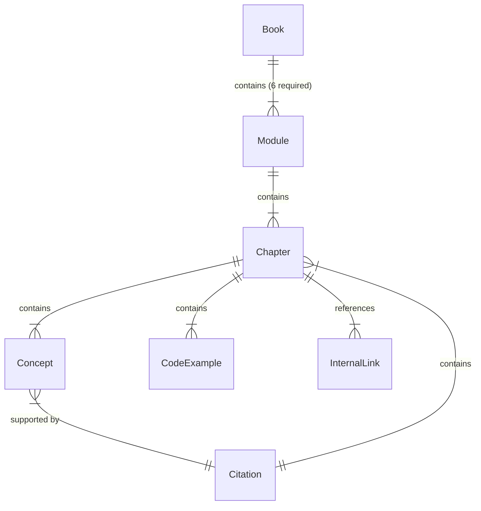

# Data Model: Physical AI & Humanoid Robotics Book

**Branch**: `001-physical-ai-book` | **Date**: 2025-12-30
**Purpose**: Define content structure entities, relationships, and validation rules

---

## Entity-Relationship Diagram



---

## Entity Definitions

### Book

The root entity representing the complete educational book.

**Attributes**:
- `title`: String - "Physical AI & Humanoid Robotics"
- `author`: String - Author name(s)
- `version`: String - Semantic version (e.g., "1.0.0")
- `description`: String - Brief description
- `created_date`: DateISO - Publication date

**Relationships**:
- Has 6 Module instances (required by SC-001)

**Validation Rules**:
- Must contain exactly 6 modules (SC-001)
- Must have a valid version following semantic versioning

---

### Module

A major content section representing a learning unit.

**Attributes**:
- `module_id`: String - Numeric prefix (e.g., "00-introduction", "01-ros2-fundamentals")
- `title`: String - Module title
- `order`: Float - Sequence number (0.0 to 5.0)
- `prerequisites`: List[ModuleId] - Required modules to read first
- `learning_objectives`: List[String] - What readers will learn
- `priority`: String - "P1", "P2", or "P3" (from user stories)

**Relationships**:
- Belongs to 1 Book
- Contains 1 to 5 Chapter instances
- References prerequisite Module instances

**Required Modules** (SC-001):
1. `00-introduction` - Physical AI Fundamentals (P1)
2. `01-ros2-fundamentals` - ROS 2 Fundamentals (P1)
3. `02-digital-twin` - Digital Twin Simulation (P2)
4. `03-nvidia-isaac` - NVIDIA Isaac Platform (P2)
5. `04-vla-conversational` - Vision-Language-Action & Conversational Robotics (P3)
6. `05-capstone` - Capstone System Design (P3)

**Validation Rules**:
- Must have a unique `module_id` starting with 00-05
- Must have `order` matching `module_id` numeric prefix
- Prerequisites must reference valid existing modules
- Must contain at least 1 chapter
- Priority must be "P1", "P2", or "P3"

---

### Chapter

An individual content unit within a module following the mandated 4-section template (FR-002).

**Attributes**:
- `chapter_id`: String - Filename (e.g., "embodied-intelligence")
- `module_id`: String - Parent module reference
- `title`: String - Chapter title
- `order`: Float - Sequence within module
- `prerequisites`: List[String] - Concepts or skills required
- `learning_objectives`: List[String] - What readers will learn
- `sections`: Map - Four required sections

**Required Sections** (FR-002, Constitution):
```yaml
sections:
  introduction:
    content: String  # What this chapter covers, prerequisites, learning objectives
  core_concepts:
    concepts: List[Concept]  # Key ideas, terminology, theoretical foundations
  examples:
    code_examples: List[CodeExample]  # Practical applications, runnable code
  summary:
    takeaways: List[String]  # Key takeaways, what was learned, next steps
```

**Relationships**:
- Belongs to 1 Module
- Contains 1 to many Concept instances
- Contains 1 to many CodeExample instances
- Contains 0 to many InternalLink instances (to other chapters)
- References 0 to many Citation instances (in core_concepts)

**Validation Rules**:
- Must have a unique `chapter_id` within its module
- All four sections must be present (SC-002)
- `learning_objectives` must align with content in `core_concepts` and `examples`
- `summary.takeaways` must reinforce `learning_objectives`
- Must contain at least 1 CodeExample (FR-003)
- Internal links must reference valid chapter IDs (SC-012)

---

### Concept

A key terminology item with definition and citations.

**Attributes**:
- `name`: String - Concept name
- `definition`: String - Definition or explanation
- `prerequisites`: List[ConceptId] - Related concepts that must be understood first

**Relationships**:
- Belongs to 1 Chapter
- Supported by 0 to many Citation instances

**Validation Rules**:
- Must have a clear, concise definition
- All factual claims must be supported by at least 1 Citation (FR-004, FR-005)
- Prerequisites must reference valid concepts (can be in previous chapters)

---

### CodeExample

A runnable code snippet demonstrating a concept.

**Attributes**:
- `language`: String - Programming language or format (Python, C++, bash, YAML, text)
- `purpose`: String - What the example demonstrates
- `code`: String - Source code
- `expected_output`: String - What the code should produce
- `explanation`: String - Comments explaining non-obvious logic (FR-013)

**Relationships**:
- Belongs to 1 Chapter
- Demonstrates 0 to many Concept instances

**Validation Rules**:
- Must be logically correct and runnable (FR-003)
- Must include comments explaining non-obvious logic (FR-013)
- Language must be valid (Python, C++, bash, YAML, text)
- Must produce expected output when executed (SC-003)
- Explanation must clarify how the code works

---

### Citation

A reference to a source supporting factual claims.

**Attributes**:
- `citation_id`: String - Unique identifier (e.g., "ros2-docs", "isaac-sim-guide")
- `source_type`: String - "official_doc", "spec", "blog", "paper"
- `author`: String - Author or authority (e.g., "Open Robotics", "NVIDIA")
- `title`: String - Document title
- `publication_date`: String - Publication date or last updated date
- `url`: String - URL to source
- `apa_citation`: String - APA-style citation string

**Relationships**:
- Supports 0 to many Concept instances
- Attached to 0 to many Chapter instances (for general claims)

**Validation Rules**:
- Must follow APA-style format (FR-005)
- Source type must be one of: "official_doc", "spec", "blog", "paper"
- URL must be accessible (FR-015, SC-013)
- Author must be a reputable authority
- Must include access date if URL is dynamic

---

### InternalLink

A cross-reference to another chapter or concept.

**Attributes**:
- `target_type`: String - "chapter" or "concept"
- `target_id`: String - ID of the target chapter or concept
- `context`: String - Why this link is relevant

**Relationships**:
- Belongs to 1 Chapter

**Validation Rules**:
- Target must exist (SC-012)
- Must not create circular dependencies
- Context should explain why the link is useful
- Should only reference previous modules (progressive difficulty)

---

## Data Model Summary

| Entity    | Purpose                                      | Relationships                          | Validation Constraints              |
|-----------|----------------------------------------------|---------------------------------------|-------------------------------------|
| Book      | Root book entity                             | Has 6 Modules                         | Exactly 6 modules (SC-001)          |
| Module    | Learning unit (6 required)                   | Has Chapters, references Prerequisites | Unique ID, 1-5 chapters             |
| Chapter   | Content unit (4-section template)            | Has Concepts, CodeExamples, Links     | All 4 sections present (SC-002)     |
| Concept   | Key terminology with definition             | Supported by Citations                | All claims cited (FR-004)           |
| CodeExample| Runnable code demonstration                 | Demonstrates Concepts                 | Runnable, commented (FR-003, FR-013)|
| Citation  | Source reference for factual claims         | Supports Concepts/Chapters            | APA-style, valid URL (FR-005)       |
| InternalLink| Cross-chapter reference                    | Belongs to Chapter                    | Valid target, no cycles (SC-012)    |

---

## Validation Rules Summary

### Book-Level Validation

1. **Module Count (SC-001)**: Book MUST contain exactly 6 modules
2. **Module Ordering**: Modules MUST be ordered 00-05 sequentially
3. **Logical Progression**: Each module MUST build on previous modules (FR-012)

### Module-Level Validation

1. **Template Compliance (FR-002)**: Each chapter MUST follow 4-section structure
2. **Prerequisites**: Module prerequisites MUST reference existing modules
3. **Priority Consistency**: Priority (P1/P2/P3) MUST match user story assignments
4. **Learning Objectives**: Module objectives MUST align with chapter content

### Chapter-Level Validation

1. **Template Compliance (FR-002, SC-002)**: All four sections MUST be present
2. **Code Examples (FR-003, SC-003)**: Code MUST be runnable and produce expected output
3. **Citations (FR-004, FR-005, SC-004)**: All factual claims MUST have citations
4. **Internal Links (FR-014, SC-012)**: All internal links MUST resolve correctly
5. **Progressive Difficulty (SC-008)**: Content MUST progress from beginner to intermediate

### Content-Level Validation

1. **Originality (FR-009)**: All content MUST be original (zero plagiarism)
2. **Accuracy (Constitution I)**: All technical claims MUST be traceable to reliable sources
3. **Clarity (Constitution II)**: Writing MUST be clear, structured, suitable for self-learning
4. **Sim-First (FR-008)**: Content MUST be simulation-first (no mandatory physical robot ownership)
5. **Humanoid Focus (FR-019)**: Humanoid robots as primary case studies with transferability notes

All validation rules are derived from feature requirements (FR-001 through FR-020), success criteria (SC-001 through SC-013), and constitution principles.
