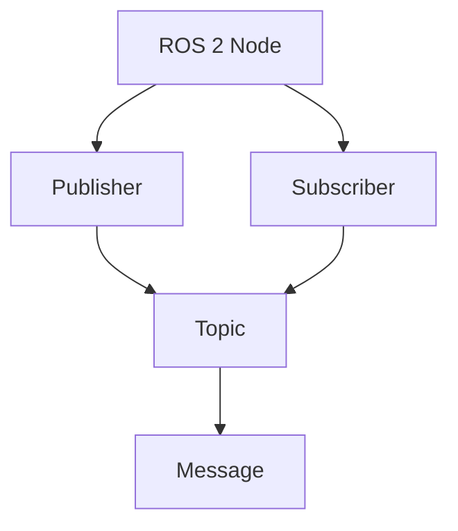

# Quickstart: Physical AI & Humanoid Robotics Book

**Branch**: `001-physical-ai-book` | **Date**: 2025-12-30
**Purpose**: Get started with book content creation and Docusaurus deployment

---

## Prerequisites

### Required Knowledge
- Basic Python programming knowledge (assumption from spec)
- Foundational understanding of AI and machine learning concepts (assumption from spec)
- Familiarity with Markdown syntax
- Basic Git/GitHub knowledge

### Required Tools
- **Node.js 18+**: Required for Docusaurus
- **npm or yarn**: Package manager for Node.js dependencies
- **Git**: Version control
- **GitHub account**: For GitHub Pages deployment
- **Code editor**: VS Code recommended (with Markdown and MDX support)

---

## Initial Setup

### 1. Clone or Initialize Repository

If the repository doesn't exist yet:
```bash
git init
git checkout -b 001-physical-ai-book
```

### 2. Install Docusaurus

Initialize Docusaurus in the `book/` directory:
```bash
npx create-docusaurus@latest book classic
cd book
npm install
```

### 3. Configure Docusaurus

Edit `book/docusaurus.config.js`:

```javascript
module.exports = {
  title: 'Physical AI & Humanoid Robotics',
  tagline: 'A comprehensive guide to embodied intelligence',
  url: 'https://[your-username].github.io', // Replace with your GitHub Pages URL
  baseUrl: '/[repository-name]/',          // Replace with repository name

  // Preset configuration
  presets: [
    [
      '@docusaurus/preset-classic',
      {
        docs: {
          path: 'docs',
          routeBasePath: '/',
          sidebarPath: require.resolve('./sidebars.js'),
          // ... other config
        },
        blog: false,  // Disable blog if not needed
        theme: {
          customCss: require.resolve('./src/css/custom.css'),
        },
      },
    ],
  ],

  // Mermaid plugin for diagrams
  plugins: [
    require.resolve('@docusaurus/mermaid'),
  ],

  themeConfig: {
    navbar: {
      title: 'Physical AI & Humanoid Robotics',
      items: [
        { to: '/', label: 'Home', position: 'left' },
      ],
    },
    footer: {
      style: 'dark',
      copyright: `Copyright © ${new Date().getFullYear()} Physical AI & Humanoid Robotics. Built with Docusaurus.`,
    },
  },
};
```

### 4. Configure Sidebar

Edit `book/sidebars.js`:

```javascript
module.exports = {
  // By default, Docusaurus generates a sidebar from the docs folder structure
  tutorialSidebar: [
    {
      type: 'autogenerated',
      dirName: '.', // Generate sidebar from docs folder
    },
  ],
};
```

---

## Creating Book Content

### Content Structure

Create the following directory structure under `book/docs/`:

```
book/docs/
├── 00-introduction/
│   ├── intro.md
│   ├── embodied-intelligence.md
│   ├── simulation-first.md
│   └── summary.md
├── 01-ros2-fundamentals/
│   ├── intro.md
│   ├── nodes-topics.md
│   ├── services-actions.md
│   ├── urdf.md
│   ├── rclpy-basics.md
│   └── summary.md
├── 02-digital-twin/
├── 03-nvidia-isaac/
├── 04-vla-conversational/
└── 05-capstone/
```

### Chapter Template

Every chapter MUST follow this structure (FR-002, Constitution):

```markdown
---
title: Chapter Title
---

## Introduction

What this chapter covers, prerequisites, learning objectives.

**Prerequisites**: [List required concepts or skills]
**Learning Objectives**:
- [ ] Objective 1
- [ ] Objective 2

## Core Concepts

Key ideas, terminology, and theoretical foundations.

### Concept 1

Definition or explanation with citations[^1].

### Concept 2

Another concept with references to previous chapters. See [Related Chapter](../00-introduction/embodied-intelligence.md) for more details.

## Examples / Code Snippets

Practical applications and runnable code.

### Example 1

**Purpose**: What this example demonstrates.

```python
#!/usr/bin/env python3
"""
Code example demonstrating concept X.
"""

def example_function():
    # Code with comments explaining non-obvious logic
    pass

if __name__ == "__main__":
    example_function()
```

**Expected Output**: What the code should produce

**Explanation**: Comments explain non-obvious logic and how the code works.

## Summary

Key takeaways, what was learned, and next steps.

**Key Takeaways**:
- Takeaway 1
- Takeaway 2

**What You Learned**:
- [ ] Concept 1
- [ ] Concept 2

**Next Steps**: [Connect to next chapter]
```

### Citations

Use APA-style citations with Markdown footnotes:

```markdown
ROS 2 is the industry standard middleware for robotics[^1]. The architecture supports distributed systems with fault tolerance[^2].

[^1]: Open Robotics. (2024). *ROS 2 Documentation*. https://docs.ros.org/en/humble/
[^2]: Open Robotics. (2024). *ROS 2 Concepts*. https://docs.ros.org/en/humble/Concepts.html
```

### Diagrams

Use Mermaid.js for architecture diagrams and flowcharts:

```markdown

```

### Internal Links

Use relative paths for internal references:

```markdown
See [ROS 2 Fundamentals](../01-ros2-fundamentals/nodes-topics.md) for more details on node communication.
```

---

## Local Development

### Start Development Server

```bash
cd book
npm run start
```

Navigate to `http://localhost:3000` to preview the book.

### Build Production Version

```bash
cd book
npm run build
```

The built site will be in `book/build/`.

---

## Deployment to GitHub Pages

### Option 1: Deploy Command

From the book directory:
```bash
GIT_USER=[your-github-username] npm run deploy
```

This builds the site and deploys it to the `gh-pages` branch.

### Option 2: GitHub Actions

Create `.github/workflows/deploy.yml`:

```yaml
name: Deploy to GitHub Pages

on:
  push:
    branches: [main, 001-physical-ai-book]

jobs:
  deploy:
    runs-on: ubuntu-latest
    steps:
      - uses: actions/checkout@v3
      - uses: actions/setup-node@v3
        with:
          node-version: 18
      - run: cd book && npm install
      - run: cd book && npm run build
      - name: Deploy to GitHub Pages
        uses: peaceiris/actions-gh-pages@v3
        with:
          github_token: ${{ secrets.GITHUB_TOKEN }}
          publish_dir: ./book/build
```

### Configure GitHub Pages Settings

1. Go to repository Settings → Pages
2. Set Source to `gh-pages` branch
3. Save settings
4. Access the book at `https://[your-username].github.io/[repository-name]/`

---

## Validation Checklist

Before committing content, validate:

### Content Quality
- [ ] All chapters follow the 4-section template (FR-002)
- [ ] All factual claims have citations (FR-004, FR-005)
- [ ] Code examples are runnable and logically correct (FR-003, SC-003)
- [ ] Internal links resolve correctly (SC-012)
- [ ] External links are accessible (FR-015)

### Build Validation
- [ ] `npm run build` completes without errors (FR-016, SC-005)
- [ ] `npm run start` loads all pages correctly
- [ ] Mermaid diagrams render correctly
- [ ] No broken links in build warnings

### Git Best Practices
- [ ] Commit messages are descriptive (FR-018, SC-007)
- [ ] Branch name follows feature convention (`001-physical-ai-book`)
- [ ] Clean commit history with logical increments

---

## Workflow Summary

1. **Plan**: `/sp.plan` generates `plan.md`, `research.md`, `data-model.md`
2. **Tasks**: `/sp.tasks` generates `tasks.md` with implementation tasks
3. **Implement**: Create content following chapter template
4. **Validate**: Run `npm run build` and checklist
5. **Commit**: Descriptive commit messages per FR-018
6. **Deploy**: `npm run deploy` or GitHub Actions

---

## Next Steps

After completing this quickstart:

1. Review [`spec.md`](./spec.md) for detailed requirements
2. Review [`research.md`](./research.md) for technology choices and best practices
3. Review [`data-model.md`](./data-model.md) for content structure and validation
4. Run `/sp.tasks` to generate implementation tasks
5. Start creating content following the chapter template

---

## Troubleshooting

### Docusaurus Build Fails
- Check for Markdown syntax errors
- Validate all internal links exist
- Ensure MDX syntax is correct

### Mermaid Diagrams Not Rendering
- Verify `@docusaurus/mermaid` plugin is installed
- Check Mermaid syntax in diagram blocks

### GitHub Pages Not Loading
- Verify `url` and `baseUrl` in `docusaurus.config.js`
- Check GitHub Pages settings in repository
- Ensure `gh-pages` branch exists

### External Links Broken
- Test external URLs manually
- Update citations with accessible sources
- Consider adding access dates for dynamic URLs

---

## Resources

- [Docusaurus Documentation](https://docusaurus.io/)
- [MDX Specification](https://mdxjs.com/)
- [Mermaid.js Documentation](https://mermaid.js.org/)
- [ROS 2 Official Docs](https://docs.ros.org/en/humble/)
- [NVIDIA Isaac Docs](https://docs.omniverse.nvidia.com/isaacsim/latest/)
