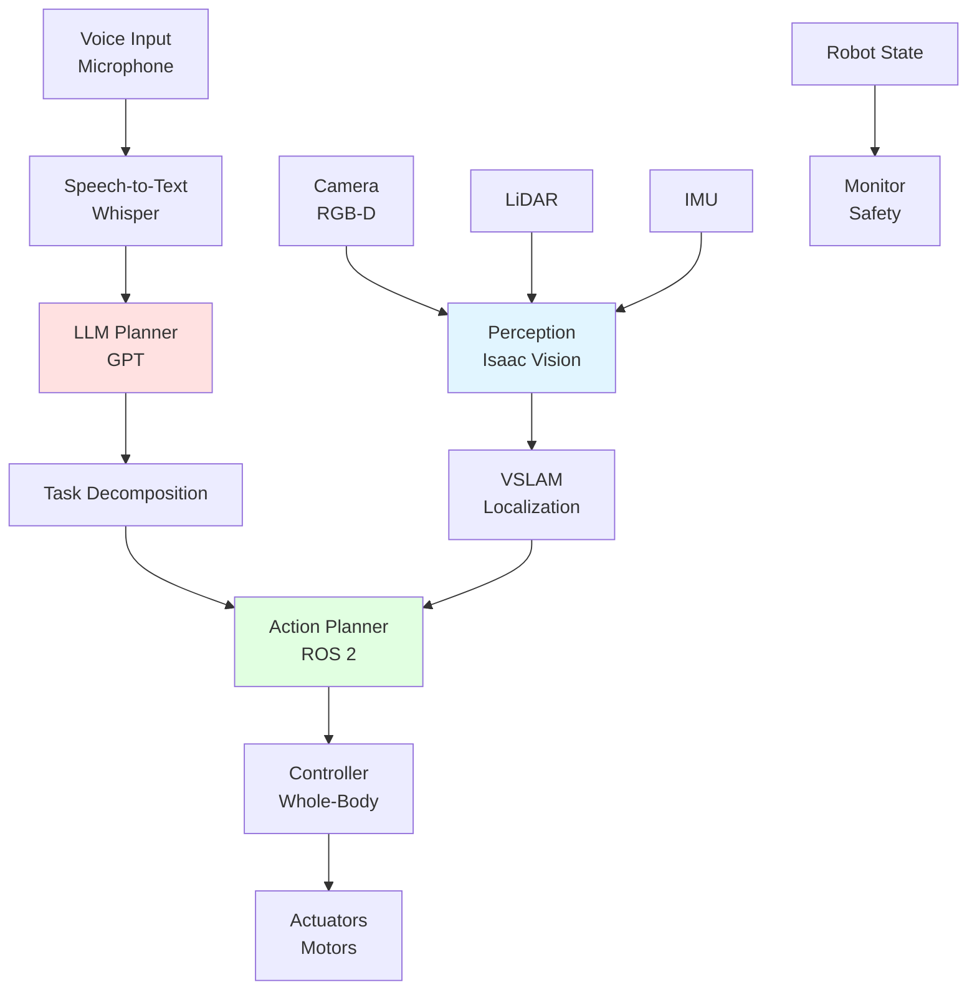

# Autonomous Humanoid System

## Learning Objectives

- Design end-to-end autonomous humanoid architecture
- Integrate all modules (perception, planning, control)
- Understand complete system flow and component interactions

## Prerequisites

- All previous modules completed

## System Architecture

## System Connectivity

Next: [End-to-End Pipeline](./end-to-end-pipeline)

## References

- Kuffner, J. (2007). *Designing Autonomous Humanoids*. Springer.
