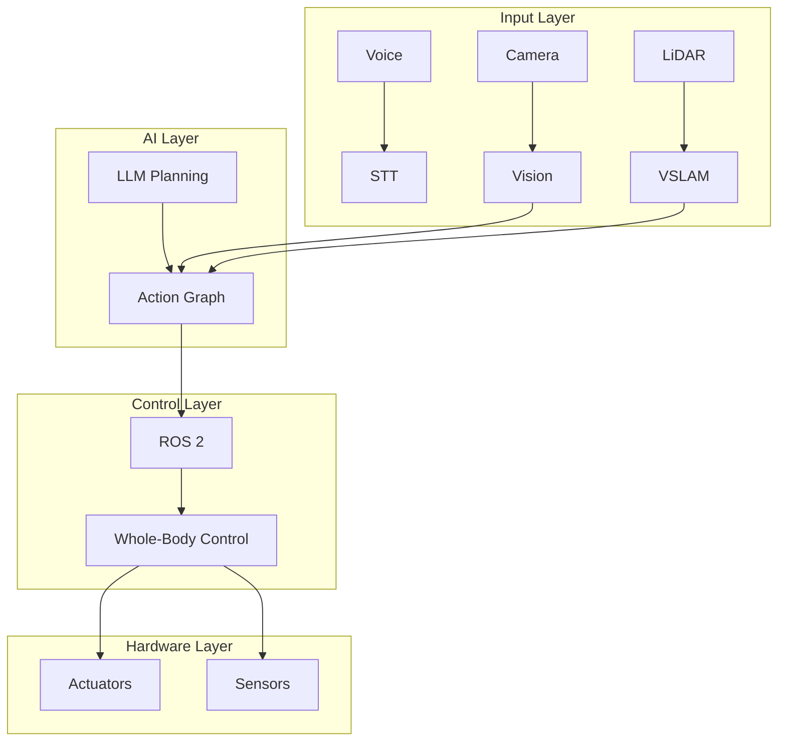

# Capstone Summary

## Learning Objectives Achieved

- Design end-to-end autonomous humanoid system
- Understand complete pipeline from voice to action
- Analyze design tradeoffs and real-world constraints
- Identify future directions in Physical AI

## System Overview

This capstone integrates all book modules:

## Congratulations!

You've completed the Physical AI & Humanoid Robotics book. You now understand:

- Physical AI fundamentals and embodied intelligence
- ROS 2 architecture and middleware
- Digital twin simulation (Gazebo, Unity)
- NVIDIA Isaac platform and GPU robotics
- VLA systems and conversational robotics
- Humanoid kinematics and locomotion
- Hardware architectures and sim-to-real challenges
- Complete autonomous humanoid system design

## Next Steps

- Build your own Physical AI system
- Explore advanced topics from cited references
- Contribute to open-source robotics projects

## References

- Book citations throughout modules
