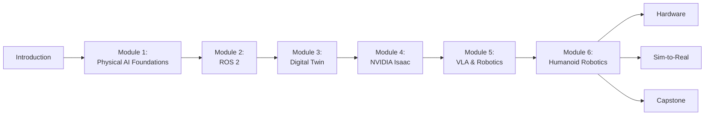

# Physical AI & Humanoid Robotics Book

Welcome to the comprehensive guide to Physical AI and Humanoid Robotics.

This book provides:
- **Foundations** of Physical AI and embodied intelligence
- **ROS 2** middleware for robotic systems
- **Digital twin** simulation platforms (Gazebo, Unity)
- **NVIDIA Isaac** platform for GPU-accelerated robotics
- **VLA systems** for conversational robotics
- **Humanoid robotics** kinematics, locomotion, and interaction

## Start Learning

Begin with [Physical AI Fundamentals](./intro/physical-ai-fundamentals) to understand what Physical AI is and why it matters.

## Book Structure

## Quick Links

- [Physical AI Fundamentals](./intro/physical-ai-fundamentals)
- [Why Humanoids Matter](./intro/why-humanoid-robotics-matters)
- [How to Use This Book](./intro/how-to-use-this-book)
- [ROS 2 Architecture](./modules/module-2-ros2/ros2-architecture)
- [Gazebo Concepts](./modules/module-3-digital-twin/gazebo-concepts)
- [Isaac Sim GPU](./modules/module-4-isaac/isaac-sim-gpu)
- [VLA Systems](./modules/module-5-vla/vision-language-action)
- [Humanoid Kinematics](./modules/module-6-humanoid/humanoid-kinematics)
- [Hardware & Labs](./hardware/workstations-jetson)
- [Capstone System](./capstone/autonomous-humanoid-system)
