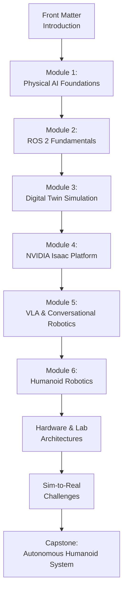
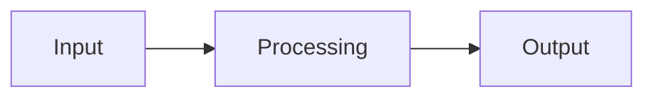

# How to Use This Book

## Learning Objectives

By the end of this chapter, you will understand:
- The book's structure and recommended reading order
- Required software and hardware (or lack thereof)
- How to run code examples
- How to follow along with exercises

## Prerequisites

- Basic Python programming knowledge
- Foundational understanding of AI and machine learning concepts
- Familiarity with command-line interface
- Git for version control (optional but recommended)

## Book Structure

This book is organized into **6 core modules**, plus sections on hardware, sim-to-real challenges, and a capstone system design.



### Module Overview

| Module | Focus | Prerequisites |
|---------|--------|--------------|
| **Front Matter** | What is Physical AI? Why humanoids? How to learn? | None |
| **Module 1** | Embodied intelligence, simulation-first workflows | Front Matter |
| **Module 2** | ROS 2: nodes, topics, services, URDF | Module 1 |
| **Module 3** | Digital twins: Gazebo, Unity, sensors | Module 2 |
| **Module 4** | NVIDIA Isaac: GPU perception, VSLAM, Nav2 | Modules 1-3 |
| **Module 5** | VLA: LLMs, speech, conversational robotics | Modules 1-4 |
| **Module 6** | Humanoid kinematics, locomotion, interaction | Modules 1-5 |

## Recommended Reading Path

### For Complete Beginners

1. **Start with Front Matter** (Introduction to Physical AI, Why Humanoid Robotics Matters)
2. **Work through Modules 1-6 in order**—each builds on previous knowledge
3. **Read Hardware & Lab Architecture** after completing core modules to understand infrastructure
4. **Study Sim-to-Real Challenges** to understand deployment constraints
5. **Complete Capstone** to see how all concepts integrate into a full system

### For Specific Interests

- **Software Engineers**: Focus on Modules 1-2 (Foundations, ROS 2) then jump to Module 4 (Isaac) for perception pipelines
- **AI/ML Researchers**: Read Module 1 for context, then Modules 3-5 (Simulation, Isaac, VLA) for model training
- **Hardware Enthusiasts**: Modules 1-2 provide context; focus on Hardware & Lab Architecture and Module 6 (Humanoid Robotics)
- **Product Managers/Leaders**: Read Front Matter and Module 1; browse modules for understanding; focus on Capstone for system design overview

### For Hackathon/Project Work

Use the book as a reference:
1. **Front Matter** and **Module 1** for foundational concepts
2. **Specific modules** relevant to your project (e.g., ROS 2 for middleware, Isaac for perception)
3. **Sim-to-Real** section for deployment considerations
4. **Capstone** as a template for end-to-end system design

## Simulation-First Learning

This book is **simulation-first**—you can learn and complete exercises **without physical robots**.

### Why This Approach?

- **Accessibility**: Simulation runs on any computer (with modest GPU)
- **Safety**: No risk of damaging expensive hardware
- **Speed**: Train and iterate faster than real-time
- **Learning**: Focus on concepts without debugging hardware issues

### Optional Physical Hardware

If you have access to physical robots:
- **ROS 2 examples** in Module 2 work on any ROS 2-compatible robot
- **Isaac Sim** examples in Module 4 require NVIDIA GPU
- **Humanoid-specific content** in Module 6 applies to physical or simulated humanoids

## Software Requirements

### Essential Software

| Software | Purpose | Installation |
|-----------|---------|----------------|
| **Node.js (v20+)** | Run Docusaurus (for building book) | https://nodejs.org |
| **Python (3.8+)** | Code examples | https://python.org |
| **Git** | Version control | https://git-scm.com |

### Optional Software (for Hands-On)

| Software | Purpose | Module |
|-----------|---------|----------|
| **ROS 2 Humble/Iron** | Run ROS 2 examples | Module 2 |
| **Gazebo** | Physics simulation | Module 3 |
| **Unity** | Game engine simulation | Module 3 |
| **NVIDIA Isaac Sim** | GPU-accelerated robotics | Module 4 |
| **Docker** | Containerized environments | Various |

### Installation Notes

- **ROS 2**: Install via Ubuntu packages (Linux) or follow Windows/macOS guides
- **Gazebo**: Included with ROS 2 installation
- **Isaac Sim**: Requires NVIDIA GPU; download from NVIDIA developer portal
- **Unity**: Free version sufficient for robotics simulation

## Working with Code Examples

Each chapter includes runnable code examples. Here's how to use them:

### Running Python Examples

```bash
# Create virtual environment (recommended)
python -m venv venv
source venv/bin/activate  # On Windows: venv\Scripts\activate

# Install dependencies (example)
pip install torch numpy rclpy

# Run example
python chapter_example.py
```

### Running ROS 2 Examples (Module 2)

```bash
# Source ROS 2 setup
source /opt/ros/humble/setup.bash  # Adjust for your distro

# Build workspace
cd your_ros_ws
colcon build --packages-select your_package

# Source workspace
source install/setup.bash

# Run node
ros2 run your_package your_node
```

### Running Simulation Examples (Modules 3-4)

```bash
# Gazebo (Module 3)
ros2 launch your_gazebo_package empty_world.launch.py

# Isaac Sim (Module 4)
# Launch Isaac Sim GUI
./isaac-sim/python.sh
# Then run Python scripts from Isaac Python environment
```

## Chapter Template

Every chapter follows a consistent structure:

### 1. Introduction
- **Learning Objectives**: What you'll be able to do after reading
- **Prerequisites**: Knowledge or previous chapters required
- **Overview**: Brief description of chapter content

### 2. Core Concepts
- Conceptual explanations
- Mermaid diagrams for visualization
- System-level descriptions (no full implementation code)

### 3. Examples / Code Snippets
- Runnable code demonstrating key concepts
- Comments explaining non-obvious logic
- Language: Python (mostly), some bash/YAML/C++ for context

### 4. Summary
- **Key Takeaways**: Bullet points of main concepts
- **Next Steps**: Links to related chapters
- **Transferability Notes**: How concepts apply to other robot types

## Mermaid Diagrams

This book uses **Mermaid.js** diagrams for visualizing architecture and flows. These render automatically in Docusaurus:



In book repository, diagrams render correctly. If viewing Markdown files locally, use:
- VS Code with Mermaid extension
- Online Mermaid editor: https://mermaid.live
- Docusaurus dev server: `cd website && npm start`

## Citation Style

The book uses **APA-style citations** in Markdown format. References appear at end of each chapter.

**In-text citation format:**
- Author, Year: "As stated by NVIDIA (2024)..."
- Parenthetical: "GPU simulation enables faster training (NVIDIA, 2024)"

**References section** at chapter end provides full details.

## Exercises and Self-Assessment

While this book doesn't include quizzes, you can test understanding by:

1. **Reproducing diagrams**: Draw architecture flows from memory
2. **Explaining concepts**: Teach a chapter to someone else (or rubber duck!)
3. **Running code examples**: Verify they work; modify to test understanding
4. **Connecting modules**: Explain how concepts from earlier chapters apply to current topic

## Getting Help

If you encounter issues:

1. **Check prerequisites**: Ensure required software is installed and configured
2. **Consult official docs**: Citations link to authoritative sources (ROS 2 docs, Isaac docs, etc.)
3. **Check GitHub issues**: Search for similar problems in repository
4. **Report issues**: If you find errors or unclear explanations, open an issue on GitHub repository

## Spec-Kit Plus Workflow

This book was developed using **Spec-Kit Plus**, a spec-driven development workflow:

1. **Specification**: Define what to build (content requirements, learning outcomes)
2. **Planning**: Design structure, research decisions, chapter outlines
3. **Task Generation**: Break down work into actionable tasks
4. **Implementation**: Write chapters following spec-driven requirements
5. **Validation**: Verify technical accuracy, build success, link integrity

This ensures:
- **Consistent structure** across all chapters
- **Spec-driven completeness**: No gaps in content
- **Quality gates**: Validation before submission
- **Traceability**: Clear connection between spec and implementation

## System Connectivity

After reading this guide:

1. **Proceed to Module 1** for Physical AI foundations
2. **Reference specific modules** based on your interests
3. **Return to this guide** anytime for clarification on structure or workflow

## Summary

**Key Takeaways:**

1. **Progressive path**: Read modules 1-6 in order; hardware/sim-to-real/capstone come after
2. **Simulation-first**: No physical robot required for learning
3. **Consistent structure**: Each chapter follows Introduction → Core Concepts → Examples → Summary template
4. **Code examples**: Runnable Python/Ros 2/simulation code with explanations
5. **Citations**: APA-style references to official docs and research papers

**Next Steps:**

Proceed to [Module 1: Physical AI Foundations](../modules/module-1-foundations/what-is-physical-ai) to begin core content.

## References

- Docusaurus (2024). *Getting Started*. https://docusaurus.io/docs
- ROS 2 (2024). *Installation*. https://docs.ros.org/en/humble/Installation.html
- NVIDIA (2024). *Isaac Sim Documentation*. https://docs.omniverse.nvidia.com/isaac-sim
