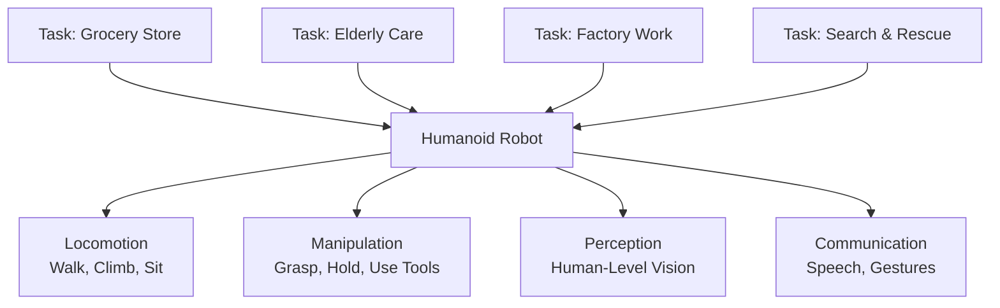
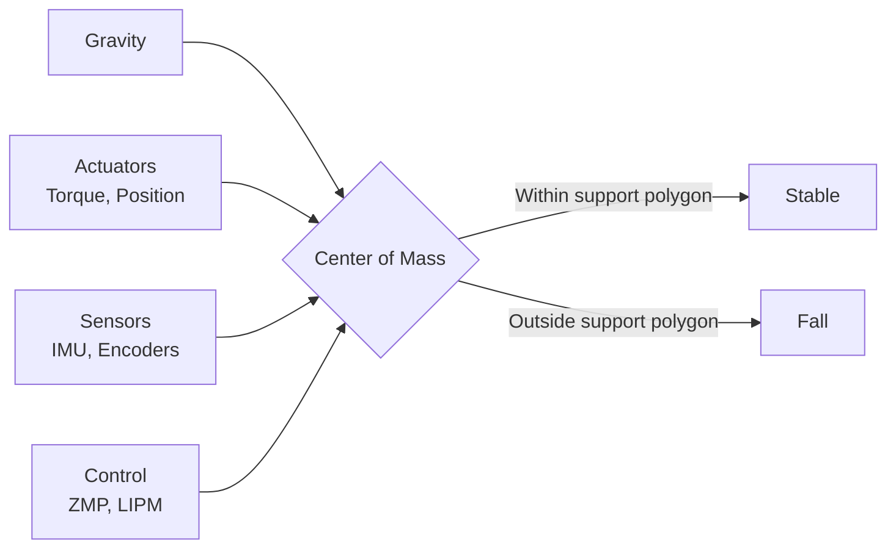

# Why Humanoid Robotics Matters

## Learning Objectives

By the end of this chapter, you will be able to:
- Explain why humanoid form factor is significant for robotics
- Identify key applications and research areas for humanoid robots
- Understand challenges unique to humanoid robotics
- Describe how humanoid robots differ from other robot forms

## Prerequisites

- Read: [Introduction to Physical AI](./physical-ai-fundamentals)
- Basic understanding of human anatomy and movement

## The Humanoid Advantage

Why build robots that look and move like humans? The answer isn't just aesthetics—humanoid form factor offers distinct advantages for interacting with world built for humans.

### 1. Human-Centered Environments

Most of our world—buildings, tools, vehicles, workspaces—is designed for human form and capabilities.


A robot with humanoid morphology can:
- **Walk through doorways** and navigate stairs without special adaptations
- **Use tools** designed for human hands (hammers, screwdrivers, keyboards)
- **Sit in chairs**, operate vehicles designed for human operators
- **Work in factories and homes** built for human workers

### 2. Human-Robot Collaboration

Humanoid robots are designed to work alongside humans naturally.

**Social Cues**: Two arms, two legs, head at human height enable natural communication. Humans instinctively understand humanoid gestures, gaze direction, and posture.

**Predictability**: Humans can anticipate humanoid behavior because it mirrors human movement patterns. This is critical for safe collaboration in shared spaces.

**Transfer of Skills**: Humans can demonstrate tasks (pick up cup, open door) and humanoid robots can mimic or learn from those demonstrations more directly than robots with different morphologies.

### 3. Universal Interface

Humanoids represent a **general-purpose interface** to the physical world. While specialized robots (robot arms, autonomous vehicles, drones) excel at specific tasks, humanoids aim for versatility:



One humanoid robot (in theory) can perform tasks that would require multiple specialized robots.

## Key Applications and Research

### 1. Manufacturing and Logistics

Humanoids in factories handle tasks requiring dexterity and flexibility:

- **KUKA** and **Boston Dynamics** develop humanoids for assembly lines
- **Agility Robotics**' Digit humanoid handles warehouse logistics
- **Figure AI** focuses on humanoids for general-purpose labor

These robots work alongside human workers, taking on dangerous or repetitive tasks while maintaining ability to use existing tools and workstations.

### 2. Healthcare and Elderly Care

An aging global population creates demand for robotic caregivers:

- **SoftBank Robotics' Pepper** (though not fully humanoid) pioneered social interaction
- **Toyota's Human Support Robot** aims to assist elderly at home
- Research humanoids help with: medication delivery, fall detection, companionship, mobility assistance

Key challenges: safe interaction with fragile humans, emotional intelligence, trust and privacy.

### 3. Disaster Response and Exploration

Humanoids navigate environments designed for humans:

- **DARPA Robotics Challenge** (2013, 2015) drove research in humanoid disaster response
- Humanoids enter disaster zones, rubble, or hazardous facilities to perform tasks humans can't safely accomplish
- Space agencies (NASA, JAXA) research humanoids for space station maintenance and planetary exploration

### 4. Personal Assistance and Entertainment

Consumer-focused humanoids represent growing market:

- **Honda's ASIMO** demonstrated humanoid capabilities in entertainment
- **Unitree's H1** and other recent models push performance boundaries
- **Tesla's Optimus** aims to bring humanoids to mass market

These robots focus on: affordable manufacturing, safe home operation, natural interaction, social presence.

## Humanoid vs Alternative Morphologies

Why not use wheeled robots, quadrupeds, or flying drones?

### Comparison Table

| Factor | Humanoid | Wheeled Base | Quadruped | Drone |
|---------|-----------|---------------|------------|--------|
| **Terrain** | Stairs, rough | Flat, ramps | Rough, stairs | Air, limited payload |
| **Manipulation** | Dual-arm, hands | Single arm often | Often none | Gripper or none |
| **Energy** | Higher (bipedal) | Lower | Medium | High (flight) |
| **Stability** | Challenging | High | High | Medium (wind) |
| **Human interaction** | Natural | Limited | Limited | Distant |
| **Versatility** | Highest | Low | Medium | Low |

### When Each Form Factor Wins

- **Wheeled robots**: Best for predictable environments (warehouses, hospitals) with smooth floors and defined paths
- **Quadrupeds**: Excel on rough terrain, outdoor exploration, and carrying moderate loads without need for manipulation
- **Drones**: Ideal for inspection, aerial delivery, and rapid response where ground access is impossible
- **Humanoids**: Best for human-centered environments requiring both mobility and manipulation

Humanoids sacrifice efficiency for **versatility** and **natural interaction**—a trade-off justified for general-purpose robots operating alongside humans.

## Unique Challenges of Humanoid Robotics

### 1. Balance and Stability

Bipedal locomotion is inherently unstable. Humans constantly adjust; humanoid robots must do same with actuators, sensors, and control algorithms.



Key concepts:
- **Zero Moment Point (ZMP)**: Point where ground reaction force has no moment; must remain within support polygon for stability
- **Linear Inverted Pendulum Model (LIPM)**: Simplified model for balance control
- **Dynamic gait**: Humanoids use dynamic walking (falling forward and catching themselves) rather than static balance

### 2. Energy Efficiency

Bipedal walking is energy-intensive compared to wheels. Humanoid robots must optimize:
- **Actuator efficiency**: Use regenerative braking, efficient motors, compliant mechanisms
- **Control algorithms**: Minimize unnecessary movements, use passive dynamics
- **Mechanical design**: Lightweight materials, optimized limb ratios

### 3. High Degrees of Freedom (DoF)

Humanoids typically have 20-30+ DoF (degrees of freedom):
- **Legs**: 6 DoF each (hip, knee, ankle)
- **Arms**: 7 DoF each (shoulder, elbow, wrist, hand)
- **Torso**: 2-3 DoF (waist, spine)
- **Head**: 2-3 DoF (neck, eyes)

Each additional DoF increases complexity: more sensors, actuators, control algorithms, and potential failure points.

### 4. Human-Robot Safety

Humanoids operating near people must guarantee safety:

- **Collision detection**: Stop immediately on impact
- **Force limiting**: Cap force output to human-safe levels
- **Soft materials**: Use compliant skin, padding to reduce injury risk
- **Predictive safety**: Anticipate collisions and avoid them

## The Current State: Research and Commercial

### Research Breakthroughs

Recent years have seen dramatic progress:

1. **Deep Reinforcement Learning for Locomotion**: Robots learn to walk from scratch in simulation using RL (e.g., DeepMind's work)
2. **Whole-Body Control**: Algorithms coordinate entire robot body rather than treating limbs independently
3. **Sim-to-Real Transfer**: Domain randomization and system identification bridge simulation-reality gap
4. **Perception-Action Integration**: Vision and proprioception tightly coupled for robust behavior

### Commercial Momentum

Companies racing to commercialize humanoids:
- **Boston Dynamics**: Atlas (research) and Spot (quadruped commercial)
- **Agility Robotics**: Digit for warehouse logistics
- **Figure AI**: Figure 01 for general-purpose labor
- **Tesla**: Optimus aiming for mass production
- **Unitree**: H1 research humanoid pushing speed and agility
- **Xiaomi**: CyberOne exploring consumer applications

## Code Example: Bipedal Control Simplified

```python
# Simplified bipedal balance control (conceptual)
import numpy as np

class BipedalController:
    """
    Maintains balance by controlling Zero Moment Point (ZMP).
    This is a simplified illustration; real controllers
    use full-body dynamics and contact models.
    """

    def __init__(self):
        self.zmp_reference = np.array([0.0, 0.0])  # Desired ZMP
        self.kp = 100.0  # Proportional gain
        self.kd = 10.0   # Derivative gain

    def update(self, current_zmp):
        """
        Compute ankle torque to maintain ZMP within support polygon.
        """
        # PD controller on ZMP error
        zmp_error = self.zmp_reference - current_zmp
        torque = self.kp * zmp_error + self.kd * zmp_error

        return torque

    def is_stable(self, zmp):
        """
        Check if ZMP is within support polygon.
        """
        # Support polygon for double support: foot stance
        support_polygon = self.get_support_polygon()
        return self.point_in_polygon(zmp, support_polygon)
```

This snippet illustrates **ZMP-based control**, one approach among many (LIPM, centroidal dynamics, whole-body MPC) used in humanoid locomotion.

## System Connectivity

Understanding humanoid robotics prepares you for:

- **Module 2 (ROS 2)**: Learn middleware for coordinating high-DoF humanoid control
- **Module 3 (Simulation)**: Understand how humanoids are modeled and tested in Gazebo/Isaac
- **Module 4 (NVIDIA Isaac)**: Explore GPU-accelerated perception and control for humanoids
- **Module 6 (Humanoid Robotics)**: Deep dive into kinematics, locomotion, and manipulation

## Transferability Notes

While humanoids have unique challenges, concepts transfer:

- **Balance control** applies to any bipedal or multi-legged robot
- **Manipulation** algorithms (grasping, motion planning) work on robot arms and manipulators
- **Human-robot safety** principles apply to any robot operating near people
- **Perception-action loops** are universal across all Physical AI systems

## Summary

**Key Takeaways:**

1. **Humanoid form factor** enables natural interaction with human-centered environments
2. **Versatility**: Humanoids aim to be general-purpose, unlike specialized robot forms
3. **Challenges**: Balance, energy efficiency, high DoF, and safety require sophisticated control
4. **Applications span** manufacturing, healthcare, disaster response, personal assistance
5. **Progress**: Recent breakthroughs in RL, whole-body control, and sim-to-real transfer enable more capable humanoids

**Next Steps:**

Read [How to Use This Book](./how-to-use-this-book) to understand recommended learning path, or proceed directly to [Module 1: Physical AI Foundations](../modules/module-1-foundations/what-is-physical-ai).

## References

- Boston Dynamics (2024). *Atlas: The next generation of humanoid robotics*. https://www.bostondynamics.com
- Kajita, S., et al. (2014). *Humanoid Walking and Running*. Springer.
- DARPA (2015). *DARPA Robotics Challenge Finals*. https://www.darpa.mil
- Figure AI (2024). *Figure 01: General purpose humanoid robot*. https://www.figure.ai
