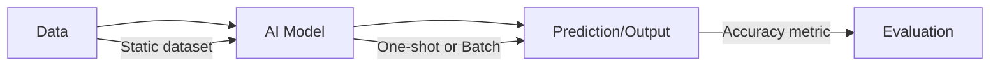
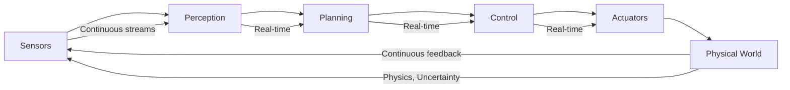
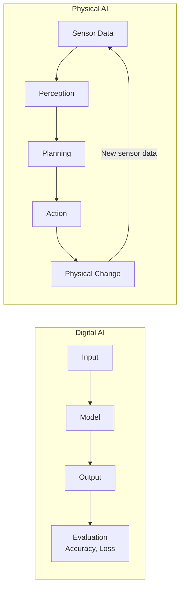

# Digital vs Physical AI

## Learning Objectives

By end of this chapter, you will be able to:
- Contrast digital AI systems with physical AI systems
- Identify unique challenges and constraints of each domain
- Understand why physical AI requires different approaches than digital AI
- Map key differences in data, feedback, and deployment

## Prerequisites

- Read: [What is Physical AI?](./what-is-physical-ai)
- Basic understanding of AI/ML concepts

## Fundamental Differences

### The Digital Domain

Digital AI operates in purely computational spaces:



**Characteristics:**
- **Static or batch processing**: Process images, text, data once or in batches
- **No real-time pressure**: Can take seconds or minutes to compute
- **Deterministic environments**: Same input produces same output (usually)
- **Controlled data**: Training data curated, labeled, relatively clean
- **Failure = incorrect prediction**: No physical consequences

### The Physical Domain

Physical AI operates in real world:



**Characteristics:**
- **Continuous operation**: Perceive, plan, act continuously at 10-100+ Hz
- **Real-time constraints**: Must respond within milliseconds for safety
- **Uncertain environments**: Lighting, weather, people change constantly
- **Noisy data**: Sensor noise, drift, occlusion
- **Failure = physical consequences**: Collisions, damage, unsafe situations

## Key Differences

### 1. Data

| Aspect | Digital AI | Physical AI |
|---------|-----------|-------------|
| **Source** | Static datasets | Continuous sensor streams |
| **Volume** | Terabytes of pre-collected data | Terabytes of real-time data |
| **Quality** | Curated, labeled | Noisy, unlabeled, ambiguous |
| **Distribution** | Known at training time | Shifts over time, unpredictable |
| **Temporal** | Often static sequences | Real-time, ordered, critical |

**Example**: Training an object detector
- **Digital AI**: Train on COCO dataset (pre-labeled images)
- **Physical AI**: Deploy detector on robot; it encounters objects it never saw, in lighting it was't trained for, with sensor noise

### 2. Time and Latency

```python
# Digital AI: No real-time constraint
import torch
import time

model = load_model("object_detector.pth")
image = load_image("test.jpg")

start = time.time()
detections = model(image)
end = time.time()

print(f"Inference time: {end - start:.3f} seconds")
# Output: Inference time: 0.150 seconds
# Acceptable for batch processing, unacceptable for real-time control
```

```python
# Physical AI: Must meet real-time constraints
import rclpy
from sensor_msgs.msg import Image

class RealTimeDetector(Node):
    """
    Object detector for Physical AI with real-time constraints.
    """
    def __init__(self):
        super().__init__('realtime_detector')
        self.subscription = self.create_subscription(
            Image, '/camera/rgb', self.detect, 10)
        self.publisher = self.create_publisher(
            Image, '/detections', 10)
        self.inference_time_budget = 0.050  # 50ms budget

    def detect(self, msg):
        """
        Detect objects within real-time budget.
        """
        start_time = self.get_clock().now()

        # Convert and detect (simplified)
        detections = self.model_inference(msg)

        inference_time = (
            self.get_clock().now() - start_time
        ).nanoseconds / 1e9

        if inference_time > self.inference_time_budget:
            # Fallback: use faster model or skip frame
            self.get_logger().warn(
                f"Inference {inference_time:.3f}s exceeds budget"
            )
            return

        self.publisher.publish(detections)
```

Physical AI systems must optimize for:
- **Latency**: Perception-to-action delay must be under 100ms for safety
- **Throughput**: Process continuous streams at high frame rates (30+ fps)
- **Consistency**: Avoid jitter in processing time

### 3. Environment

| Aspect | Digital AI | Physical AI |
|---------|-----------|-------------|
| **Control** | Controlled, predictable | Uncontrolled, unpredictable |
| **Physics** | None or simulated | Real physics apply |
| **Change** | Static or scheduled | Continuous, unexpected |
| **Safety** | No physical safety needed | Physical safety critical |

**Example**: Object classification
- **Digital AI**: Classify 1000 ImageNet images in controlled environment
- **Physical AI**: Classify objects in factory while forklifts move, lights flicker, people walk by

### 4. Feedback



**Digital AI feedback**: Metrics like accuracy, loss, F1-score—offline evaluation
**Physical AI feedback**: Physical consequences—did robot fall? Did task succeed? Was it safe?

### 5. Deployment

| Aspect | Digital AI | Physical AI |
|---------|-----------|-------------|
| **Rollback** | Easy: redeploy model | Hard: physically update robots |
| **Monitoring** | Simple: metrics, logs | Complex: sensors, telemetry |
| **Updates** | Instant, global | Manual, per-robot |
| **Risk** | Degraded performance | Physical damage, safety incidents |

## Implications for AI System Design

### 1. Model Selection

**Digital AI**: Can use large, computationally expensive models
- Transformers (BERT, GPT)
- Deep ResNets
- Ensemble models

**Physical AI**: Must balance accuracy with real-time constraints
- Efficient architectures (MobileNet, EfficientNet)
- Pruned/quantized models
- Specialized hardware acceleration (Edge TPUs, NPUs)

### 2. Training Data

**Digital AI**: Collect and curate datasets
- ImageNet, COCO for vision
- Wikipedia, Common Crawl for language
- High-quality human annotations

**Physical AI**: Learn from interaction
- Self-supervised learning from sensor streams
- Sim-to-real transfer (train in simulation, deploy to reality)
- Domain randomization to handle real-world variability

### 3. Robustness

**Digital AI**: Robustness = handle input variations (lighting, occlusion)

**Physical AI**: Robustness = handle physical world variations + maintain safety
- Sensor failure detection and fallback
- Redundant sensing modalities (vision + LiDAR)
- Safe failure modes (stop, ask for help)

### 4. Testing and Validation

**Digital AI**: Test on held-out datasets
- Train/validation/test split
- Measure accuracy, precision, recall
- Cross-validation

**Physical AI**: Test in real environments
- Simulation testing for rapid iteration
- Limited real-world testing (expensive, time-consuming)
- Edge case testing (stairs, ramps, doorways)

## Code Example: Digital vs Physical Approach

### Digital AI: Batch Image Classification

```python
# Digital AI: Classify batch of images
import torch
from torchvision import models, transforms

model = models.resnet50(pretrained=True).eval()
transform = transforms.Compose([
    transforms.Resize(256),
    transforms.CenterCrop(224),
    transforms.ToTensor(),
    transforms.Normalize(mean=[0.485, 0.456, 0.406],
                     std=[0.229, 0.224, 0.225]),
])

# Load batch of images
images = [
    load_image("cat1.jpg"),
    load_image("dog.jpg"),
    load_image("bird.jpg"),
]

inputs = torch.stack([transform(img) for img in images])

# Classify (batch processing)
with torch.no_grad():
    outputs = model(inputs)
    predictions = outputs.argmax(dim=1)

print("Predictions:", predictions)
# Output: Predictions: tensor([281, 207, 14])
# Each is an ImageNet class ID
```

This is **one-shot classification**—no continuous interaction, no physical consequences.

### Physical AI: Continuous Perception and Action

```python
# Physical AI: Continuous perception-action loop
import rclpy
from sensor_msgs.msg import Image
from geometry_msgs.msg import Twist

class PhysicalAISystem(Node):
    """
    Physical AI: continuous perception and action.
    """
    def __init__(self):
        super().__init__('physical_ai_system')
        self.camera_sub = self.create_subscription(
            Image, '/camera/rgb', self.perceive, 10)
        self.cmd_pub = self.create_publisher(
            Twist, '/cmd_vel', 10)
        self.model = self.load_model()

    def perceive(self, msg):
        """
        Perceive continuously and trigger action.
        """
        # 1. Perception (must be fast!)
        start_time = self.get_clock().now()
        detections = self.detect_objects(msg)
        inference_time = (
            self.get_clock().now() - start_time
        ).nanoseconds / 1e9

        # 2. Check real-time constraint
        if inference_time > 0.100:  # 100ms budget
            self.get_logger().warn(f"Too slow: {inference_time:.3f}s")
            return

        # 3. Planning based on detections
        cmd = self.plan(detections)

        # 4. Act
        self.cmd_pub.publish(cmd)

    def plan(self, detections):
        """
        Plan actions based on current detections.
        """
        cmd = Twist()

        if not detections:
            # No objects: rotate to search
            cmd.angular.z = 0.5
            cmd.linear.x = 0.0
        else:
            # Object detected: approach
            target = detections[0]
            # Simple proportional controller to center object
            error = target['center_x'] - 320  # Camera center
            cmd.angular.z = -error * 0.01
            cmd.linear.x = 0.2 if abs(error) < 50 else 0.0

        return cmd
```

This Physical AI system **operates continuously**, with real-time constraints and physical consequences for failures.

## System Connectivity

Understanding digital vs Physical AI prepares you for:
- **Next chapter**: [Simulation-First Workflows](./simulation-first-workflows) on bridging digital and physical domains
- **Module 2 (ROS 2)**: Learn middleware that enables real-time physical AI systems
- **Module 3 (Simulation)**: Understand how to test physical AI systems in virtual worlds

## Transferability Notes

All Physical AI systems face these differences from digital AI:
- **Mobile robots** must handle continuous data, real-time constraints, uncertain environments
- **Manipulators** need robust perception-action loops with physical consequences
- **Drones** operate with similar constraints: continuous streams, real-time response, physical safety

The digital-to-physical transition is universal challenge for any embodied AI system.

## Summary

**Key Takeaways:**

1. **Data**: Digital AI uses static datasets; Physical AI uses continuous, noisy streams
2. **Time**: Digital AI has no real-time pressure; Physical AI must respond within milliseconds
3. **Environment**: Digital AI in controlled space; Physical AI in unpredictable physical world
4. **Feedback**: Digital AI uses accuracy metrics; Physical AI gets physical consequences
5. **Design Implications**: Physical AI requires efficient models, robust handling, real-time architecture

**Next Steps:**

Continue to [Simulation-First Workflows](./simulation-first-workflows) to learn how simulation bridges digital and physical domains.

## References

- Krizhevsky, A., et al. (2012). *ImageNet Classification with Deep Convolutional Neural Networks*. NeurIPS.
- Open Robotics (2024). *ROS 2 Real-Time Performance*. https://docs.ros.org
- NVIDIA (2024). *Real-Time Perception for Robotics*. https://developer.nvidia.com
