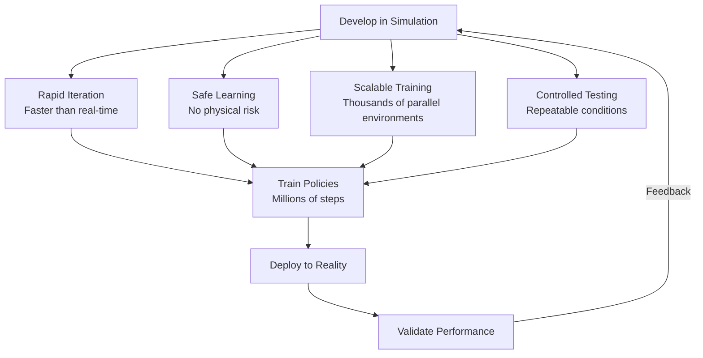
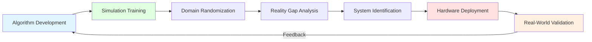
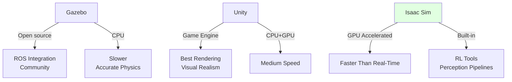

# Simulation-First Workflows

## Learning Objectives

By end of this chapter, you will be able to:
- Explain why simulation-first workflows are standard in Physical AI development
- Describe the sim-to-real pipeline and key challenges
- Understand domain randomization for bridging simulation-reality gap
- Compare simulation platforms: Gazebo, Unity, Isaac Sim

## Prerequisites

- Read: [What is Physical AI?](./what-is-physical-ai)
- Read: [Digital vs Physical AI](./digital-vs-physical-ai)

## What is Simulation-First Development?

**Simulation-first development** means developing and testing Physical AI systems primarily in simulation, with real-world deployment happening later.

### Why Simulation-First?



### Key Benefits

| Benefit | Description |
|---------|-------------|
| **Accessibility** | No physical robot required; anyone can learn and develop |
| **Speed** | GPU simulation runs faster than real-time (10-100x) |
| **Safety** | Robots can fail millions of times without damage or danger |
| **Scalability** | Train across thousands of parallel environments |
| **Control** | Precisely vary conditions for testing and debugging |
| **Cost** | Simulation runs on commodity hardware; no robot depreciation |

### Example: Learning to Walk

```python
# Simulation-first: learn bipedal walking in Isaac Sim
"""
Conceptual: train walking policy in simulation.
Real implementation uses Isaac Sim RL API.
"""

import numpy as np

class BipedalWalkerTrainer:
    """
    Train bipedal walking policy using reinforcement learning in simulation.
    """
    def __init__(self):
        self.env = self.load_isaac_sim_environment()
        self.policy = self.initialize_policy()

    def load_isaac_sim_environment(self):
        """
        Load humanoid environment in Isaac Sim.
        """
        # Isaac Sim provides physics simulation
        # with accurate rigid-body dynamics
        return IsaacSimEnv(
            robot_file="humanoid.urdf",
            enable_gpu_physics=True,
            substeps=8  # Physics substeps for accuracy
        )

    def train(self, num_episodes):
        """
        Train walking policy across many episodes.
        """
        for episode in range(num_episodes):
            state = self.env.reset()

            for step in range(1000):
                # Sample action from policy
                action = self.policy.act(state)

                # Step simulation
                next_state, reward, done, info = self.env.step(action)

                # Update policy (simplified RL)
                self.policy.update(state, action, reward, next_state)

                state = next_state

                if done:
                    break

            # Log metrics
            print(f"Episode {episode}, Reward: {info['total_reward']:.2f}")

# Train in simulation
trainer = BipedalWalkerTrainer()
trainer.train(num_episodes=10000)
# Can train 10,000 episodes in hours (faster than real-time)
```

In simulation, robot can fall millions of times, learn from each, and converge on stable walking—without any physical damage.

## The Sim-to-Real Pipeline

### Stages



### 1. Algorithm Development

Develop algorithms in simulation first:
- Rapid prototyping without hardware
- Debug with reproducible conditions
- Test across wide range of scenarios

### 2. Simulation Training

Train policies and models in simulation:
- Use GPU acceleration for speed
- Train across thousands of parallel environments
- Collect millions of samples in hours

### 3. Domain Randomization

Vary simulation parameters during training to improve robustness:

| Parameter | Range | Purpose |
|-----------|-------|---------|
| **Lighting** | Bright, dark, colored shadows | Handle real-world lighting variation |
| **Textures** | Random materials, patterns | Reduce overfitting to specific visuals |
| **Physics** | Friction coefficients, masses | Generalize to real materials |
| **Camera** | Noise levels, distortion | Simulate real sensor characteristics |
| **Background** | Random scenes, objects | Prevent memorization of environment |

```python
# Domain randomization during training
class DomainRandomizationEnv:
    """
    Environment with domain randomization.
    """
    def __init__(self):
        self.base_env = load_simulation()

    def reset(self):
        """
        Reset with randomized domain parameters.
        """
        # Randomize lighting
        self.base_env.set_lighting(
            intensity=np.random.uniform(0.3, 1.0),
            color=np.random.choice(['white', 'warm', 'cool'])
        )

        # Randomize physics
        self.base_env.set_friction(
            coefficient=np.random.uniform(0.3, 0.9)
        )

        # Randomize camera noise
        self.base_env.set_camera_noise(
            level=np.random.uniform(0.0, 0.1)
        )

        return self.base_env.reset()

    def step(self, action):
        return self.base_env.step(action)
```

### 4. Reality Gap Analysis

Compare simulation and reality:

| Aspect | Simulation | Reality | Gap Mitigation |
|--------|------------|---------|----------------|
| **Physics** | Perfect dynamics | Imperfect, friction varies | Domain randomization |
| **Sensors** | Ideal or calibrated | Noisy, drift | Add sensor noise to sim |
| **Actuators** | Perfect control | Delay, backlash | Model delays in sim |
| **Environment** | Controlled | Unpredictable | Randomize conditions |

### 5. System Identification

Fine-tune simulation to match reality:

```python
# System identification: measure real robot dynamics
def identify_dynamics(real_robot):
    """
    Measure real robot joint dynamics for simulation calibration.
    """
    # Apply step inputs
    torque_commands = [0.0, 1.0, 2.0, -1.0, -2.0]

    measurements = []
    for torque in torque_commands:
        real_robot.send_torque_command(torque)
        time.sleep(0.5)  # Settle

        # Measure response
        velocity = real_robot.read_velocity()
        position = real_robot.read_position()

        measurements.append({
            'torque': torque,
            'velocity': velocity,
            'position': position
        })

    # Fit model to measurements
    dynamics_model = fit_model(measurements)

    return dynamics_model

# Use identified dynamics in simulation
real_dynamics = identify_dynamics(real_humanoid)
simulation.update_dynamics(real_dynamics)
```

### 6. Hardware Deployment

Deploy trained system to real robot:
- Transfer trained policy
- Handle sensor calibration
- Configure safety constraints

### 7. Real-World Validation

Test in physical environment:
- Validate performance matches simulation
- Identify failure modes
- Refine as needed

## Simulation Platforms

### Gazebo

**Gazebo** is open-source physics simulator with ROS 2 integration.

| Feature | Description |
|---------|-------------|
| **Physics** | ODE, Bullet, Simbody physics engines |
| **ROS Integration** | Native ROS 2 support |
| **Models** | Extensive model database |
| **Cost** | Free, open-source |

**Strengths:**
- Strong ROS integration
- Large community
- Free and open-source

**Limitations:**
- Limited GPU acceleration
- Less realistic rendering than game engines

### Unity

**Unity** is game engine with robotics simulation capabilities.

| Feature | Description |
|---------|-------------|
| **Rendering** | High-fidelity graphics, realistic materials |
| **Physics** | Unity Physics, NVIDIA PhysX |
| **Integration** | ROS Bridge for ROS 2 connection |
| **Cost** | Free for non-commercial use |

**Strengths:**
- Best-in-class rendering
- Realistic visual simulation
- Large asset store

**Limitations:**
- Less accurate physics than specialized simulators
- ROS integration via bridge (not native)

### NVIDIA Isaac Sim

**Isaac Sim** is NVIDIA's robotics simulator built on Omniverse.

| Feature | Description |
|---------|-------------|
| **Physics** | NVIDIA PhysX, GPU-accelerated |
| **Rendering** | Photorealistic, ray tracing |
| **AI Integration** | Isaac Lab for RL, domain randomization |
| **GPU** | Full GPU acceleration for speed |

**Strengths:**
- GPU-accelerated (faster than real-time)
- Built-in robotics RL framework
- Integrated perception pipelines

**Limitations:**
- Requires NVIDIA GPU
- Closed-source (free for research/commercial)



## Code Example: Training in Simulation

```python
"""
Train navigation policy in Isaac Sim.
Conceptual; real code uses Isaac Lab RL API.
"""

import numpy as np

class NavigationTrainer:
    """
    Train humanoid navigation using reinforcement learning.
    """
    def __init__(self):
        # Create Isaac Sim environment
        from omni.isaac.gym.vec_env import VecEnvBase
        self.env = VecEnvBase(
            headless=True,  # Run without GUI (faster)
            sim_device='cuda:0'  # Use GPU
        )

        # PPO algorithm for training
        self.policy = PPONetwork(
            observation_dim=512,
            action_dim=12  # 6 joints × 2 legs
        )

    def train(self, num_steps):
        """
        Train navigation policy.
        """
        obs = self.env.reset()

        for step in range(num_steps):
            # Sample action from policy
            action, log_prob, value = self.policy.act(obs)

            # Step environment (parallel across all instances)
            next_obs, reward, done, info = self.env.step(action)

            # Store trajectory
            self.policy.buffer.add(
                obs, action, reward, done, log_prob, value
            )

            # Update policy periodically
            if step % 2048 == 0:
                self.policy.update()

            obs = next_obs

            if step % 10000 == 0:
                # Log progress
                avg_reward = np.mean(reward)
                print(f"Step {step}, Avg Reward: {avg_reward:.2f}")

# Train 1 million steps (hours in simulation)
trainer = NavigationTrainer()
trainer.train(num_steps=1_000_000)
```

## System Connectivity

Simulation connects to:
- **Previous chapter**: [Digital vs Physical AI](./digital-vs-physical-ai) - simulation bridges these domains
- **Module 3**: Deep dive into Gazebo and Unity simulation platforms
- **Module 4**: Isaac Sim for GPU-accelerated robotics workflows

## Transferability Notes

Simulation-first workflows are universal:
- **All robotics**: Mobile bases, manipulators, humanoids, drones
- **All domains**: Industrial automation, autonomous vehicles, healthcare robotics
- **All platforms**: Gazebo, Unity, Isaac Sim apply principles broadly

The sim-to-real challenge—bridging gap between virtual and physical—is fundamental to all Physical AI systems.

## Summary

**Key Takeaways:**

1. **Simulation-first**: Develop and train in simulation, deploy to reality later
2. **Benefits**: Accessible, fast, safe, scalable, controlled, cost-effective
3. **Sim-to-Real Pipeline**: Train → Randomize → Analyze Gap → Identify → Deploy → Validate
4. **Platforms**: Gazebo (ROS integration), Unity (rendering), Isaac Sim (GPU acceleration)
5. **Domain Randomization**: Vary simulation parameters to improve real-world robustness

**Next Steps:**

Proceed to [Module 1 Summary](./module-1-summary) to consolidate Physical AI foundations, then continue to [Module 2: ROS 2 Fundamentals](../module-2-ros2/ros2-architecture).

## References

- Open Robotics (2024). *Gazebo Simulator Documentation*. https://gazebosim.org
- NVIDIA (2024). *Isaac Sim Documentation*. https://docs.omniverse.nvidia.com/isaac-sim
- Unity Technologies (2024). *Unity Robotics Hub*. https://unity.com/robotics
