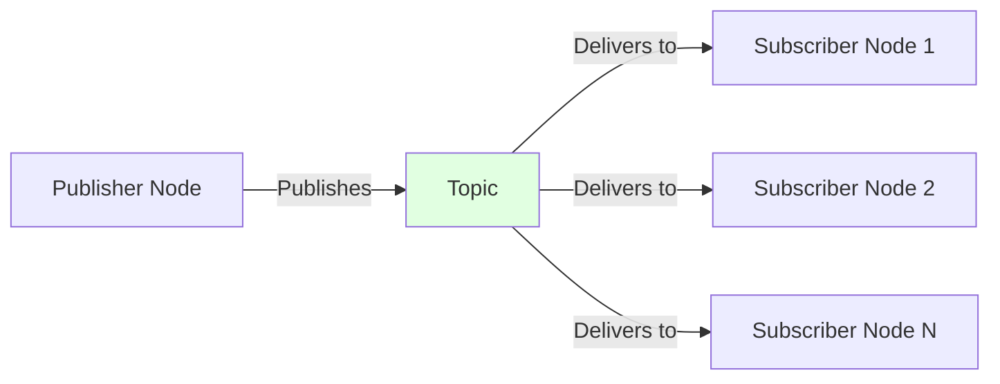

# Nodes and Topics

## Learning Objectives

By end of this chapter, you will be able to:
- Write ROS 2 nodes in Python (rclpy)
- Implement publish-subscribe patterns for communication
- Understand topic message types and QoS policies
- Build perception-action loops using topics

## Prerequisites

- Read: [ROS 2 Architecture](./ros2-architecture)
- Basic Python programming

## Publish-Subscribe Pattern



## Code Example: Publisher

```python
import rclpy
from rclpy.node import Node
from std_msgs.msg import String

class TalkerNode(Node):
    def __init__(self):
        super().__init__('talker')
        self.publisher = self.create_publisher(
            String, 'chatter', 10)
        self.timer = self.create_timer(0.5, self.timer_callback)
        self.counter = 0

    def timer_callback(self):
        msg = String()
        msg.data = f'Hello World: {self.counter}'
        self.publisher.publish(msg)
        self.counter += 1
        self.get_logger().info(msg.data)
```

## Code Example: Subscriber

```python
import rclpy
from rclpy.node import Node
from std_msgs.msg import String

class ListenerNode(Node):
    def __init__(self):
        super().__init__('listener')
        self.subscription = self.create_subscription(
            String, 'chatter', self.listener_callback, 10)

    def listener_callback(self, msg):
        self.get_logger().info(msg.data)
```

## System Connectivity

Next: [Services and Actions](./services-actions)

## References

- Open Robotics (2024). *Writing a Simple Publisher and Subscriber*. https://docs.ros.org/en/humble/Tutorials/Writing-A-Simple-Py-Publisher-And-Subscriber
