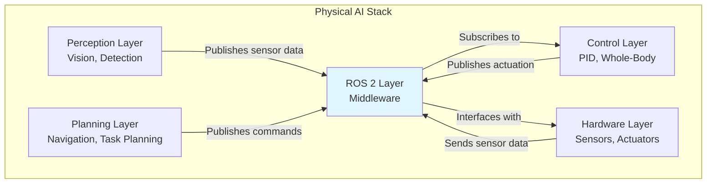
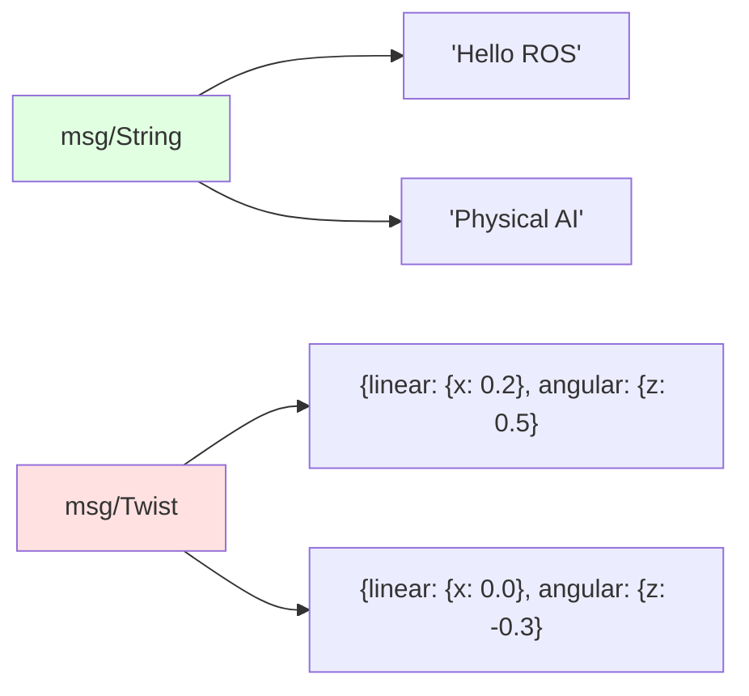
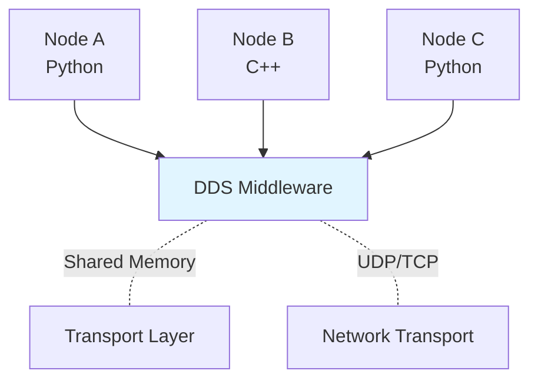
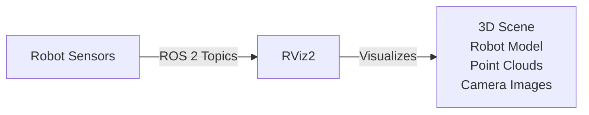

# ROS 2 Architecture

## Learning Objectives

By end of this chapter, you will be able to:
- Explain ROS 2 architecture and its role as robotic middleware
- Describe nodes, topics, services, and actions
- Understand DDS (Data Distribution Service) and communication patterns
- Identify key ROS 2 components and their purposes

## Prerequisites

- Read: [Module 1: Physical AI Foundations](../module-1-foundations/what-is-physical-ai)
- Basic understanding of computing concepts (publish/subscribe, client/server)

## What is ROS 2?

**ROS 2** (Robot Operating System 2) is middleware for robotics development. It provides:
- **Communication framework**: Nodes exchange messages via topics, services, actions
- **Hardware abstraction**: Unified interface to sensors and actuators
- **Tools**: Visualization (RViz), simulation (Gazebo), debugging
- **Package management**: Build system (colcon) and package structure

ROS 2 is **not an operating system**—it's a set of software libraries and tools that run on real OS (Linux, Windows, macOS).

### ROS 2 as "Robotic Nervous System"



ROS 2 connects perception, planning, control, and hardware—just as nervous system connects brain, motor cortex, and muscles in biological organisms.

## ROS 2 Architecture Components

### 1. Nodes

**Nodes** are executable programs that perform computation.

```mermaid
graph LR
    A[Camera Driver Node] -->|Publishes| B[/camera/image_raw]
    B -->|Subscribes| C[Perception Node]
    C -->|Publishes| D[/detections]
    D -->|Subscribes| E[Planning Node]
    E -->|Publishes| F[/cmd_vel]
    F -->|Subscribes| G[Motor Driver Node]
    G -->|Controls| H[Hardware]

    B -.Topic.- D
    D -.Topic.- F
```

**Node properties:**
- **Granular**: Each node has single responsibility
- **Decoupled**: Nodes communicate via topics, not direct calls
- **Independent**: Nodes can be written in different languages (Python, C++, etc.)
- **Process**: Each node runs as separate OS process

### 2. Topics

**Topics** are named buses for unidirectional, asynchronous communication.

| Property | Description |
|-----------|-------------|
| **Publish-Subscribe** | Many-to-many: One publisher, many subscribers |
| **Asynchronous** | No guarantee of response; fire-and-forget |
| **Stream-based** | Continuous data flows (sensor readings, commands) |
| **Weakly-typed** | Message types define data structure |

**Common topics:**
- `/camera/image_raw`: Camera image data
- `/odom`: Odometry (position, velocity)
- `/cmd_vel`: Velocity command
- `/scan`: Laser scan data (LiDAR)

### 3. Services

**Services** enable synchronous request-response communication.

```mermaid
graph LR
    A[Client Node] -->|Request| B[Service Server Node]
    B -->|Response| A
    B -.Service.- C[/get_robot_pose]

    style C fill:#e1ffe1
```

**Service properties:**
- **Client-Server**: Client requests, server responds
- **Synchronous**: Client waits for response
- **One-to-one**: Typically one client, one server (can be multiple)
- **Typed**: Request and response message types defined

**Common services:**
- `/get_pose`: Query robot position
- `/reset_odometry`: Reset odometry to zero
- `/save_map`: Save navigation map

### 4. Actions

**Actions** are long-running, preemptable operations with feedback.

```mermaid
graph LR
    A[Action Client] -->|Goal| B[Action Server]
    B -->|Feedback| A
    B -->|Result| A

    B -.Action.- C[/navigate_to_pose]

    style C fill:#ffe1e1
```

**Action properties:**
- **Goal**: Desired end state or target
- **Feedback**: Continuous progress updates
- **Result**: Final outcome (success, failure)
- **Preemptable**: Can be canceled mid-execution

**Common actions:**
- `/navigate_to_pose`: Navigate to location
- `/move_arm`: Move robotic arm to target
- `/grasp_object`: Grasp specified object

### 5. Messages

**Messages** define data structures for ROS 2 communication.



**Message categories:**
- **Primitive types**: `std_msgs` (String, Int32, Float32, etc.)
- **Common types**: `geometry_msgs` (Pose, Twist, Point)
- **Sensor types**: `sensor_msgs` (Image, LaserScan, Imu)
- **Custom types**: User-defined messages for specific applications

## DDS (Data Distribution Service)

ROS 2 uses **DDS** as its underlying transport layer.



### DDS Features

| Feature | Description |
|---------|-------------|
| **Discovery** | Nodes automatically find each other |
| **Reliability** | Configurable QoS (Quality of Service) |
| **Transport** | Shared memory (local), UDP/TCP (network) |
| **Language-agnostic** | Works with Python, C++, Java, etc. |
| **Scalability** | Handles thousands of nodes and topics |

### QoS (Quality of Service)

QoS policies determine communication behavior:

| QoS Policy | Options | Use Case |
|------------|--------|----------|
| **History** | Keep last, Keep all | Sensor streams vs state topics |
| **Depth** | Queue depth | How many messages to buffer |
| **Reliability** | Best effort, Reliable | Real-time streams vs critical commands |
| **Durability** | Transient local, Volatile | Transient data vs persistent state |

```python
# QoS configuration in Python
from rclpy.qos import QoSProfile, ReliabilityPolicy, HistoryPolicy

# Reliable (guaranteed delivery) for commands
cmd_vel_qos = QoSProfile(
    reliability=ReliabilityPolicy.RELIABLE,
    history=HistoryPolicy.KEEP_LAST,
    depth=10
)

# Best effort (drop if full) for sensor data
image_qos = QoSProfile(
    reliability=ReliabilityPolicy.BEST_EFFORT,
    history=HistoryPolicy.KEEP_LAST,
    depth=5
)
```

## Code Example: ROS 2 Node

```python
"""
ROS 2 node: Simple perception and control loop.
Demonstrates nodes, topics, and communication.
"""

import rclpy
from rclpy.node import Node
from sensor_msgs.msg import Image
from geometry_msgs.msg import Twist

class SimplePerceptionControlNode(Node):
    """
    Node that perceives camera data and publishes commands.
    """
    def __init__(self):
        # Initialize node with unique name
        super().__init__('simple_perception_control')

        # Subscribe to camera topic
        self.camera_subscription = self.create_subscription(
            Image,
            '/camera/image_raw',
            self.camera_callback,
            10  # QoS depth
        )

        # Publisher for velocity commands
        self.cmd_vel_publisher = self.create_publisher(
            Twist,
            '/cmd_vel',
            10
        )

        self.get_logger().info('Node initialized')

    def camera_callback(self, msg):
        """
        Called when new camera image arrives.
        """
        # Process image (simplified)
        self.get_logger().info(
            f'Received image: {msg.width}x{msg.height}'
        )

        # Generate command (simplified: rotate)
        cmd = Twist()
        cmd.linear.x = 0.0  # Don't move forward
        cmd.angular.z = 0.5  # Rotate slowly

        # Publish command
        self.cmd_vel_publisher.publish(cmd)

def main(args=None):
    """
    Main function: initialize ROS 2 and run node.
    """
    rclpy.init(args=args)
    node = SimplePerceptionControlNode()

    try:
        # Spin node (process callbacks)
        rclpy.spin(node)
    except KeyboardInterrupt:
        pass
    finally:
        # Cleanup
        node.destroy_node()
        rclpy.shutdown()

if __name__ == '__main__':
    main()
```

## ROS 2 Tools

### 1. RViz2

**RViz2** is 3D visualization tool for ROS 2 data.



**Features:**
- Visualize robot model (URDF)
- Display sensor data (point clouds, images, laser scans)
- Visualize TF (transform tree)
- Set goals and send commands

### 2. Gazebo

**Gazebo** integrates with ROS 2 for physics simulation.

**Features:**
- Load URDF robot models
- Simulate physics and sensors
- ROS 2 plugins for sensor and actuator simulation
- Realistic environments

### 3. RQT

**RQT** provides GUI-based tools for ROS 2.

**Features:**
- Monitor and publish to topics
- Visualize message graphs
- Debug node communication
- Service caller and action client GUI

## System Connectivity

ROS 2 architecture connects to:
- **Next chapter**: [Nodes and Topics](./nodes-topics) - deep dive into communication patterns
- **Module 3**: ROS 2 integration with simulation (Gazebo, Unity)
- **Module 4**: Isaac Sim uses ROS 2 for robotics workflows

## Transferability Notes

ROS 2 architecture applies to all Physical AI systems:
- **Mobile robots**: Use ROS 2 for navigation, perception, control
- **Manipulators**: ROS 2 coordinates arm movement and grasping
- **Humanoids**: ROS 2 manages high-DoF bipedal control
- **Drones**: ROS 2 handles flight controllers and mission planning

The publish-subscribe pattern, services, and actions are universal robotics communication concepts.

## Summary

**Key Takeaways:**

1. **ROS 2** is middleware that provides communication, tools, and hardware abstraction
2. **Nodes** are executable programs with single responsibilities
3. **Topics** enable many-to-many, asynchronous communication (sensor streams, commands)
4. **Services** provide synchronous request-response (querying state)
5. **Actions** support long-running, preemptable operations with feedback
6. **DDS** is underlying transport layer with configurable QoS
7. **Tools** (RViz2, Gazebo, RQT) support visualization and simulation

**Next Steps:**

Continue to [Nodes and Topics](./nodes-topics) to understand ROS 2 communication patterns in detail.

## References

- Open Robotics (2024). *ROS 2 Concepts*. https://docs.ros.org/en/humble/Concepts.html
- Open Robotics (2024). *DDS and ROS 2 Middleware*. https://docs.ros.org/en/humble/DDS.html
- O'Conor, M., et al. (2022). *Programming Robots with ROS 2*. O'Reilly Media.
