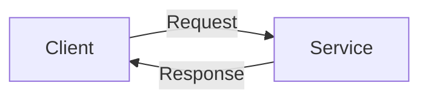
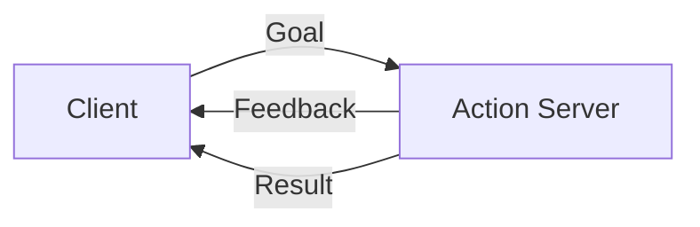

# Services and Actions

## Learning Objectives

- Implement ROS 2 services for request-response communication
- Use actions for long-running operations with feedback
- Choose between topics, services, and actions appropriately

## Services

Services enable synchronous request-response:



## Code Example: Service Server

```python
from example_interfaces.srv import AddTwoInts

class MinimalService(Node):
    def __init__(self):
        super().__init__('minimal_service')
        self.srv = self.create_service(
            AddTwoInts, 'add_two_ints', self.add_callback)

    def add_callback(self, request, response):
        response.sum = request.a + request.b
        self.get_logger().info(f'Incoming request {request.a} + {request.b}')
        return response
```

## Actions

Actions for long-running operations:



## System Connectivity

Next: [URDF Robot Descriptions](./urdf-robot-descriptions)

## References

- Open Robotics (2024). *Services Documentation*. https://docs.ros.org/en/humble/Tutorials/Understanding-ROS2-Services
