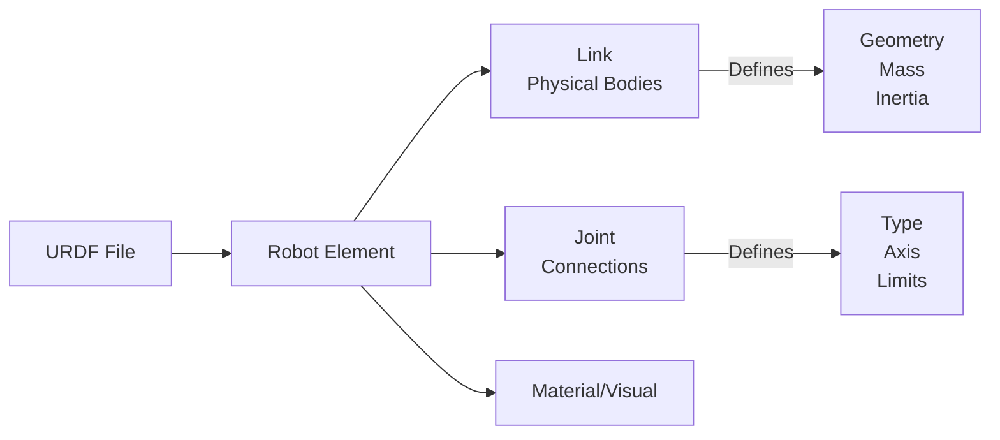

# URDF Robot Descriptions

## Learning Objectives

- Understand URDF (Unified Robot Description Format)
- Describe robot kinematics and geometry in XML
- Link URDF to ROS 2 simulation and visualization

## Prerequisites

- Read: [ROS 2 Architecture](./ros2-architecture)

## URDF Structure

## System Connectivity

Next: [rclpy Basics](./rclpy-basics)

## References

- Open Robotics (2024). *URDF Documentation*. https://wiki.ros.org/urdf
