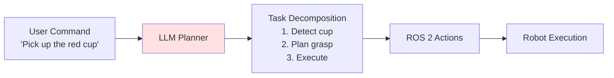

# LLM Planning

## Learning Objectives

- Understand how LLMs plan robotic tasks
- Implement task planning using language models
- Translate natural language to robot actions

## Prerequisites

- Read: [Vision-Language-Action](./vision-language-action)

## LLM for Task Planning

## System Connectivity

Next: [Speech Models](./speech-models)

## References

- OpenAI (2024). *GPT-4 for Robotics*. https://openai.com
