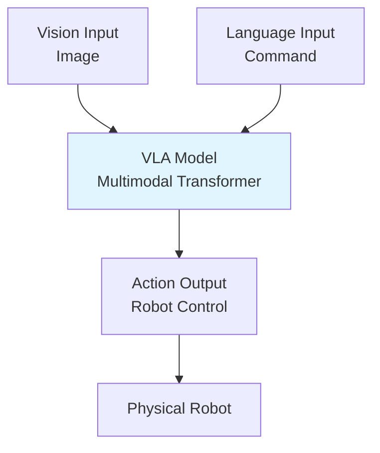

# Vision-Language-Action Systems

## Learning Objectives

- Understand VLA (Vision-Language-Action) architecture
- Learn how vision and language models integrate with robotic actions
- Explore multimodal transformer architectures for robotics

## Prerequisites

- Read: [Module 4: NVIDIA Isaac](../module-4-isaac/isaac-sim-gpu)

## VLA Concept

## System Connectivity

Next: [LLM Planning](./llm-planning)

## References

- Driess, D., et al. (2023). *PaLM-E: Embodied Multimodal Language Model*. arXiv.
