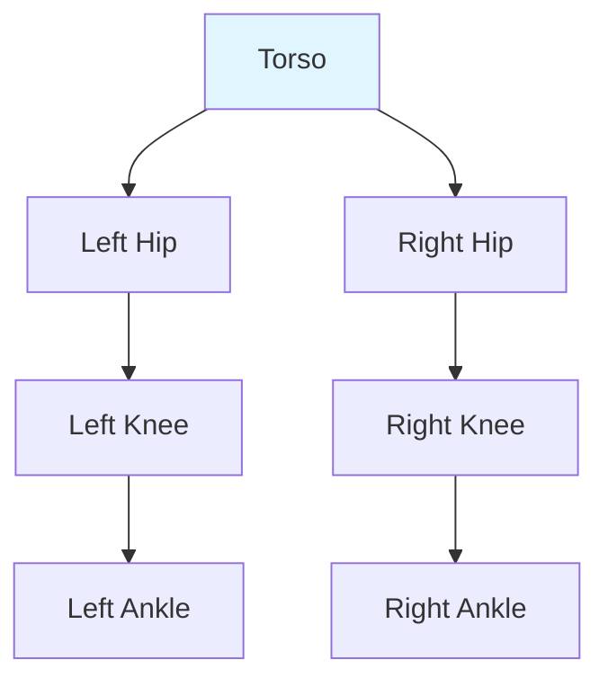

# Humanoid Kinematics

## Learning Objectives

- Understand forward and inverse kinematics for humanoids
- Describe humanoid joint structure and degrees of freedom
- Explain kinematic chains for leg and arm motion

## Prerequisites

- Read: [Module 2: ROS 2 Fundamentals](../module-2-ros2/ros2-architecture)

## Kinematic Chains

## Forward vs Inverse Kinematics

| Type | Description | Complexity |
|-------|-------------|-----------|
| **Forward** | Joint angles → End-effector position | Simple, O(n) |
| **Inverse** | End-effector position → Joint angles | Complex, O(n³) |

## System Connectivity

Next: [Locomotion](./locomotion)

## References

- Kajita, S. (2007). *Inverse Kinematics for Humanoid Robots*. Springer.
